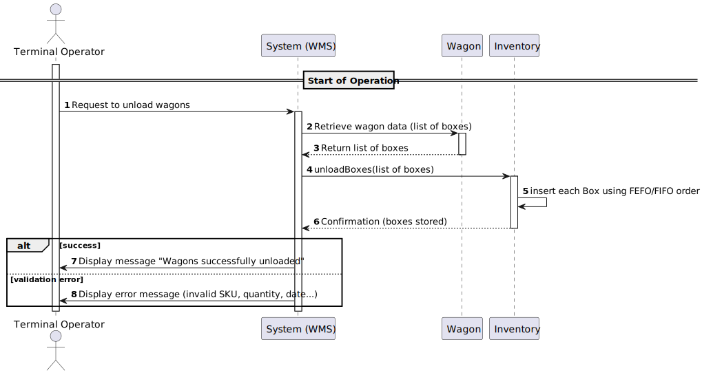

# USEI01 - Wagons Unloading (Inventory Replenishment)

## 1. Requirements Engineering

### 1.1. User Story Description

As a terminal operator, I want unloading operations of wagons to automatically store inventory using FEFO (First-Expired-First-Out) for perishable goods and FIFO (First-In-First-Out) for non-perishable goods, so that I can ensure correct dispatch order, minimize product spoilage, and maintain full traceability.

### 1.2. Customer Specifications and Clarifications 

**From the specifications document:**

>	Wagons arriving at the terminal contain several boxes of products, each representing a SKU with quantity and optional expiryDate. When unloading into warehouses, the sequence of storage must follow FEFO for perishable items and FIFO for non-perishable items.

>	Warehouses are organized in aisles and bays. Each box has a unique ID and a location in the warehouse (aisle/bay).

> The system must validate incoming wagon data: known SKUs, valid quantities, unique box IDs, valid dates, and report errors while still importing valid data.

**From the client clarifications:**

> **Question:** Are there minimum and maximum values for size?
>
> **Answer:** The number needs to be a positive on; there is no maximum, it's up to the editor to decide.

> **Question:** Is there a predefined list of sizes, or should users be able to input custom dimensions?
>
> **Answer:** Custom dimensions but suggesting predefined sizes could be a good idea.
 
> **Question:** Are there any requirements or restrictions for the map's name (e.g., character limit, allowed/disallowed characters)?
>
> **Answer:** File name like restrictions.

> **Question:** Should map names be unique within the system?
>
> **Answer:** Yes.

### 1.3. Acceptance Criteria

* **AC1:** Boxes are inserted into inventory following FEFO/FIFO rules:
  * Perishable goods: earliest expiryDate first.
  * Non-perishable goods: earliest receivedDate first.
  * Tie-breaker: boxId ascending.
  
* **AC2:** Invalid wagon records (unknown SKU, negative qty, missing expiry/received dates, duplicated boxId) are rejected with clear error messages.

* **AC3:** After unloading, inventory reflects the new boxes in the correct order.

* **AC4:** Warehouse locations (aisle/bay) are preserved or assigned as per rules.

* **AC5:** All movements are logged for traceability.

### 1.4. Found out Dependencies

* Warehouse inventory must be initialized.
* Wagons data must be imported and validated.
* SKUs must exist in items.csv.
* Bays and aisles must exist and have capacity for new boxes.

### 1.5 Input and Output Data

**Input Data:**

* Wagon records: wagonId, boxId, SKU, qty, expiryDate (optional), receivedAt.
* Warehouse layout: bays.csv (warehouseId, aisle, bay, capacityBoxes).
* roduct data: items.csv (SKU, name, category, unit, volume, unitWeight).

**Output Data:**

* Updated inventory list (boxes sorted by FEFO/FIFO).
* Log of accepted and rejected boxes with error messages.
* Confirmation message for the operator: number of boxes successfully unloaded.

### 1.6. System Sequence Diagram (SSD)

### 1.7 Other Relevant Remarks

* Unloading preserves FEFO/FIFO order per SKU.
* Boxes with invalid data do not block unloading of valid boxes.
* Empty boxes are removed from inventory, but bays remain.
* Every operation is logged for traceability.
* The Inventory class ensures automatic sorting and storage of boxes.