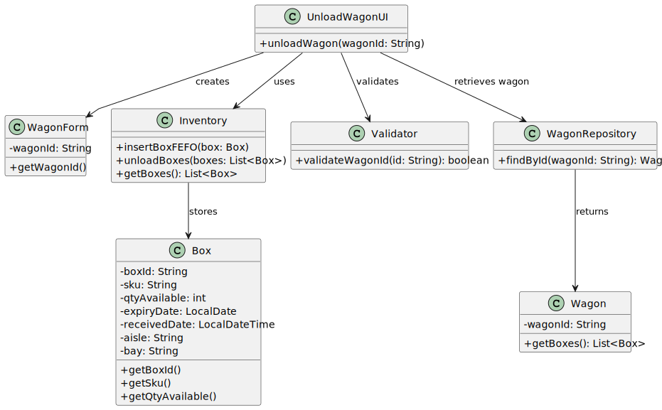

# USEI01 - Wagons Unloading (Inventory Replenishment)

## 3. Design

### 3.1. Rationale

| Interaction ID      | Question: Which class is responsible for...           | Answer             | Justification (with patterns)                                         |
|:--------------------|:------------------------------------------------------|:------------------|:----------------------------------------------------------------------|
| Step 1              | ... interacting with the actor (Terminal Operator)?  | UnloadWagonUI      | Pure Fabrication: Handles UI interactions without domain coupling.   |
|                     | ... coordinating wagon unloading?                     | WagonController    | Controller: Mediates between UI and domain logic.                     |
|                     | ... instantiating the unloading process?             | WagonController    | Creator (Rule 1): Triggers the workflow (unloadWagon()).             |
| Step 2              | ... managing wagon form data (wagonId)?              | Terminal Operator  | IE: Owns user input until submission.                                 |
|                     | ... requesting wagon data?                            | UnloadWagonUI      | IE: responsible for user interactions.                                |
|                     | ... validating wagonId and data?                     | WagonController    | Low Coupling: Centralizes validation logic.                           |
| Step 3              | ... retrieving the Wagon object from repository?     | WagonRepository    | Creator: Repository manages Wagon retrieval.                           |
| Step 4              | ... accessing the boxes within a wagon?             | Wagon              | Expert: Owns the collection of boxes; provides getBoxes().           |
| Step 5              | ... inserting boxes into inventory?                 | Inventory          | Expert: Knows how to store boxes in FEFO/FIFO order.                 |
| Step 6              | ... persisting/loading warehouse data (if applicable)? | Inventory          | IE: Manages the in-memory data structure for the warehouse.          |
| Step 7              | ... notifying the Terminal Operator of success?      | UnloadWagonUI      | IE: Responsible for user interactions and feedback.                  |

---

### Systematization

According to the rationale, the conceptual classes promoted to software classes are:

* Wagon
* Box
* Inventory
* SKU

Other software classes (i.e., Pure Fabrication) identified:

* UnloadWagonUI
* WagonController
* WagonRepository
* Validator

---

## 3.2. Sequence Diagram (SD)

### Full Diagram

This diagram shows the full sequence of interactions between the classes involved in unloading a wagon into the inventory, including validation, retrieval, and FEFO/FIFO insertion.

### Split Diagrams

The same sequence can be split to illustrate specific interactions, such as:

* **Partial Diagram 1:** Terminal Operator → UnloadWagonUI → WagonController → Validator
* **Partial Diagram 2:** WagonController → WagonRepository → Wagon → Inventory → UnloadWagonUI

Interaction Occurrences (Interaction Use) can be used to show repeated actions for multiple boxes or multiple wagons.

---

## 3.3. Class Diagram (CD)

This class diagram shows the relevant classes and relationships in USEI01:

**Highlights:**

* `Wagon` contains multiple `Box`.
* `Inventory` stores `Box` in FEFO/FIFO order.
* Each `Box` represents a single `SKU`.
* `UnloadWagonUI` mediates operator interactions.
* `WagonController` coordinates the process, ensuring validation and correct insertion.
