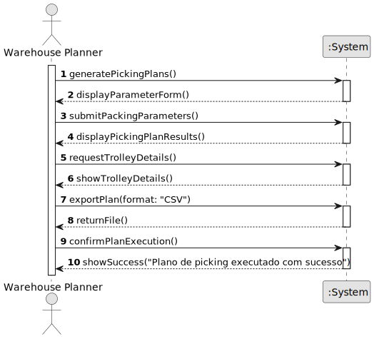

# US001 - Pack the allocation rows into trolleys

## 1. Requirements Engineering

### 1.1. User Story Description

As a planner, I want to pack the allocation rows produced by USEI02 into capacity-bounded trolleys, choosing one of the packing heuristics. So pickers can complete runs without overloading trolleys.

### 1.2. Customer Specifications and Clarifications 

**From the specifications document:**

> To satisfy the list of orders elaborated in the previous USEI02, it is required to collect products from one or more points in the warehouse.
> Pickers often use a trolley (or cart) to collect items, but all trolleys have a weight (kg) capacity that must be respected.
> It is necessary to have a pick plan that dispatches orders, or parts of orders, that fit within the capacity of the trolley.
> First Fit (FF): Place the item in the first available trolley, where it fits. The scan order should be the input order of the allocation rows.
> First Fit Decreasing (FFD): Sort unpicked allocations from US02 by weight from largest to smallest and place the item in the first available batch where it fits.
> Best Fit Decreasing (BFD): Sort all unpicked allocations from US02 by weight, from largest to smallest, and put the item into the batch that will result in the smallest amount of remaining unused capacity, i.e., the tightest fit.

**From the client clarifications:**

> **Question:** 
>
> **Answer:** 

### 1.3. Acceptance Criteria

* **AC1:** The total number of trolleys necessary to dispatch the orders.
* **AC2:** Utilisation of each trolley (usedWeight/capacityWeight, e.g., 85% full).
* **AC3:** For each trolley, provide the picking plan with all: order ID, line number, aisle, bay number, boxId, SKU, quantity.
* **AC4:** There is no limit on the number of trolleys.
* **AC5:** The capacity of each trolley should be defined by the planner.
* **AC6:** The planner must dispatch the orders, executing any one of the three packing heuristics on the same set of order lines.

### 1.4. Found out Dependencies

* There is a dependency to the USEI02, which provides the allocation rows to be packed into trolleys.

### 1.5 Input and Output Data

**Input Data:**

* Typed data:
    * trolley capacity (weight)
    * packing heuristic (First Fit, Best Fit, Worst Fit)
    * allocation rows from USEI02

**Output Data:**

* packing plan with:
    * number of trolleys used
    * utilisation of each trolley
    * for each trolley, the picking plan with all: order ID, line number, aisle, bay number, boxId, SKU, quantity.
    * confirmation of the packing process completion

### 1.6. System Sequence Diagram (SSD)

**_Other alternatives might exist._**

### 1.7 Other Relevant Remarks

* The created task stays in a "not published" state in order to distinguish from "published" tasks.