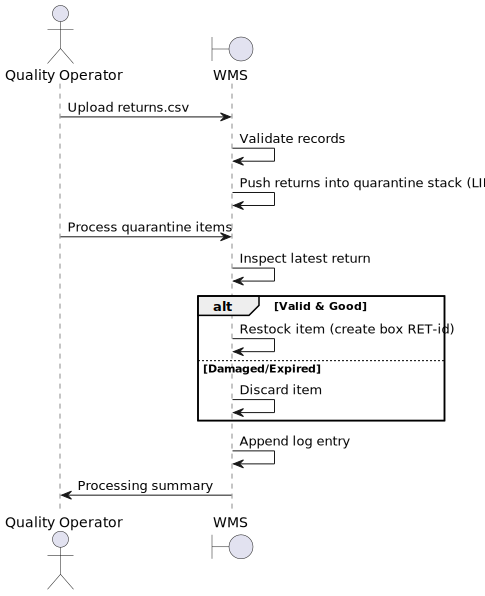

# USEI05 - Returns & Quarantine

## 1. Requirements Engineering

### 1.1. User Story Description

**As a quality operator**, I want returned goods to be placed in quarantine and processed in LIFO (Last-In-First-Out) order, so that I can inspect them efficiently, decide whether to discard or restock them, and maintain full traceability through an audit log.

### 1.2. Customer Specifications and Clarifications

**From the specifications document:**

> Returned products must be placed in quarantine before being reintroduced into inventory. The quarantine process follows LIFO order, where the most recent returns are inspected first.

> Each return record contains returnId, SKU, quantity, reason, timestamp, and optional expiryDate. The system must validate incoming return data and report errors while processing valid records.

> After inspection, products are either discarded (if damaged/expired) or restocked as new boxes with "RET-" prefix in the boxId.

**From the client clarifications:**

> **Question:** How should the system handle partial quantities when only some items from a return are restockable?
>
> **Answer:** The system supports partial restocking. If only part of the quantity is usable, both quantities (restocked and discarded) should be logged separately with their respective actions.

> **Question:** What happens when a returned product has expired?
>
> **Answer:** Expired products are automatically marked as Discarded during the inspection process and cannot be restocked.

> **Question:** Is the quarantine processing automatic or manual?
>
> **Answer:** The quality operator must manually trigger the inspection process after returns are placed in quarantine. The system processes returns in LIFO order but requires operator initiation.

### 1.3. Acceptance Criteria

- **AC1:** Returns are processed in descending timestamp order (latest first - LIFO)
- **AC2:** Invalid return records (unknown SKU, negative quantity, missing required fields) are rejected with clear error messages
- **AC3:** Restocked items are inserted as new boxes with "RET-" prefix following FEFO/FIFO rules based on product type
- **AC4:** Discarded items are permanently removed from circulation and flagged appropriately
- **AC5:** All inspection actions (Restocked/Discarded) are logged in an audit file with complete details
- **AC6:** Partial restocking is supported with separate logging for restocked and discarded quantities

### 1.4. Found out Dependencies

- Returns data must be imported and validated via returns.csv
- SKUs must exist in items.csv
- Warehouse inventory must be initialized for restocking operations
- Quarantine data structure must support LIFO operations
- Audit logging system must be available

### 1.5 Input and Output Data

**Input Data:**
- Return records: returns.csv (returnId, SKU, qty, reason, timestamp, expiryDate optional)
- Product data: items.csv (SKU, name, category, unit, volume, unitWeight)
- Warehouse inventory data for restocking

**Output Data:**
- Updated inventory with restocked items (as new boxes with "RET-" prefix)
- Quarantine status (empty after processing)
- Audit log file with inspection results
- Summary report of processed returns

### 1.6. System Sequence Diagram (SSD)

### 1.7. Other Relevant Remarks
- Quarantine follows LIFO (stack) structure for processing returns
- Restocked items become new boxes in inventory following standard FEFO/FIFO rules
- Expired products are automatically discarded without operator intervention
- All operations are logged for traceability and audit purposes
- The system supports both full and partial restocking scenarios
- Quarantine processing must be manually initiated by the quality operator

