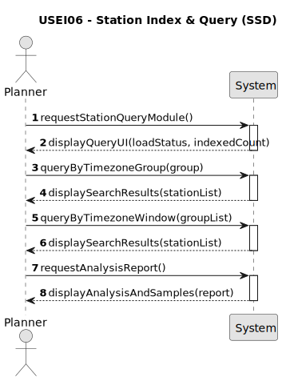

# USEI06 - Time-Zone Index and Windowed Queries

## 1. Requirements Engineering

### 1.1. User Story Description

As a planner, I want a set of BST/AVL trees that lets me quickly search by:
* latitude
* longitude
* time zone group and country

So I can efficiently retrieve all stations of a time zone group by ascending order of country or in a window of time zone groups, such as ['CET', 'WET/GMT'].

### 1.2. Customer Specifications and Clarifications

**From the specifications document (sem3_pi_2025_26_en.pdf):**

>   Planners need fast, reproducible lookups of stations by time zone group, and convenient searches by station name and country without scanning the 64k-row CSV.
>   The goal is to build efficient, deterministic query engines on top of these data using the BST/AVL implementations already made in classes.
>   The dataset contains approx. 64k European railway stations (station, latitude/longitude, country, timeZone, timeZoneGroup, and flags).

**From the client clarifications:**

>   (No specific client clarifications were provided for this User Story in the document.)

### 1.3. Acceptance Criteria

* **AC1:** Validate input data: non-empty name station, country, and time zone group. Latitude must be in the range [-90,90] and longitude in [-180,180]. Invalid rows must be rejected.
* **AC2:** If multiple stations share the same coordinates (e.g., Lisbon Santa Apolónia and Lisbon Oriente), the tree must preserve all these stations, sorted by name in ascending order.
* **AC3:** The implementation must return 3-5 sample queries demonstrating the functionality.
* **AC4:** A temporal analysis complexity report must be provided.

### 1.4. Found out Dependencies

* Depends on the availability of the European railway stations dataset (approx. 64k entries). (In your repository, this appears to be `train_stations_europe.csv`).
* Depends on the BST/AVL implementations "already made in classes".

### 1.5. Input and Output Data

**Input Data:**

* `train_stations_europe.csv` file (or equivalent) containing approx. 64k stations with fields: `station`, `latitude`, `longitude`, `country`, `timeZone`, `timeZoneGroup`, `isCity`, `isMainStation`, `isAirport`.

**Output Data:**

* In-memory data structures (BST/AVL trees) indexing the station data.
* Results from 3-5 sample queries (e.g., lists of stations).
* Temporal complexity analysis report.

### 1.6. System Sequence Diagram (SSD)

### 1.7. Other Relevant Remarks

* This User Story is part of Sprint 2.
* The solution must use the BST/AVL implementations already provided or developed in classes.