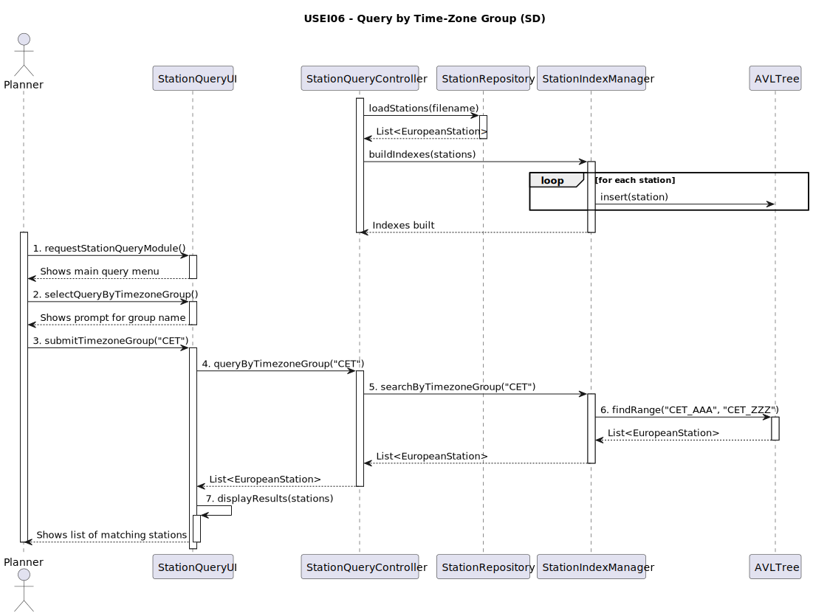
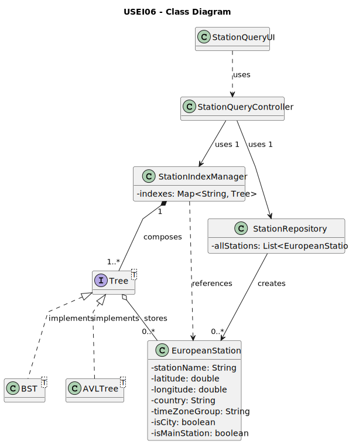

# USEI06 - Time-Zone Index and Windowed Queries

## 3. Design

### 3.1. Rationale

| Interaction ID | Question: Which class is responsible for... | Answer | Justification (with patterns) |
|:---|:---|:---|:---|
| Step 1 | ... interacting with the actor (Planner)? | StationQueryUI | **Pure Fabrication:** Handles UI interactions for station queries without domain coupling. |
| | ... coordinating the data loading and query execution? | StationQueryController | **Controller:** Mediates between the UI and the domain/service layer. |
| | ... loading the 64k stations from the CSV file? | StationRepository | **Information Expert (IE):** Knows how to parse and instantiate station data from the file. |
| | ... validating the loaded station data (AC1)? | StationRepository / EuropeanStation | **IE / Creator:** The domain object (`EuropeanStation`) can be responsible for its own validation during creation. |
| Step 2 | ... instantiating the BST/AVL trees? | StationIndexManager | **Creator (Rule 1):** Manages the lifecycle of the indexes, so it's the logical class to create them. |
| | ... holding the different indexes (by lat, lon, time-zone)? | StationIndexManager | **Information Expert:** It is the central point of access for all spatial/data indexes. |
| | ... handling multiple stations at the same coordinates (AC2)? | BST / AVLTree | **IE:** The data structure's insertion logic is responsible for handling duplicates or nodes with multiple items. |
| Step 3 | ... getting the query parameters from the Planner? | StationQueryUI | **IE:** Owns the user input. |
| | ... dispatching the query to the correct service/manager? | StationQueryController | **Controller:** Receives the UI event and calls the appropriate application logic. |
| Step 4 | ... selecting the correct tree and performing the search? | StationIndexManager | **IE:** Knows which index (e.g., `timeZoneGroupTree`) to use for a given query type. |
| | ... performing the actual data-structure search? | BST / AVLTree | **IE:** The tree itself contains the logic for efficient traversal and data retrieval. |
| Step 5 | ... notifying the Planner of the results? | StationQueryUI | **IE:** Is responsible for all user-facing interactions and rendering. |

### Systematization

According to the taken rationale, the conceptual classes promoted to software classes are:

* EuropeanStation

Other software classes (i.e. Pure Fabrication) identified:

* StationQueryUI
* StationQueryController
* StationIndexManager
* StationRepository (or StationLoader)
* BST (data structure)
* AVLTree (data structure)

## 3.2. Sequence Diagram (SD)

### Full Diagram

This diagram shows the full sequence of interactions between the classes involved in the realization of this user story.

### Split Diagrams

*(This section can be used if the full diagram is too complex)*

## 3.3. Class Diagram (CD)

