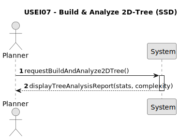

# USEI07 - Build a balanced 2D-Tree on Latitude/Longitude

## 1. Requirements Engineering

### 1.1. User Story Description

[cite_start]As a data engineer, I want to build a balanced 2D-tree using (latitude, longitude) so that range and proximity searches run efficiently and deterministically. [cite: 677]

### 1.2. Customer Specifications and Clarifications

**From the specifications document (sem3_pi_2025_26_en.pdf):**

>   [cite_start]We need a spatial index over 64k (aprox.) European train stations to enable fast geographic queries. [cite: 675] [cite_start]A KD-tree (k=2) on (latitude, longitude) supports range and nearest-neighbour operations much faster than scanning all stations. [cite: 676]

### 1.3. Acceptance Criteria

* [cite_start]**AC1:** The 2D-tree must be built using a balanced, "bulk build" strategy, not sequential insertions. [cite: 678]
* [cite_start]**AC2:** The build strategy must efficiently use the BST/AVL trees (or the sorted lists derived from them) of latitude and longitude created in `USEI06`. [cite: 679] (Note: PDF incorrectly states USEI01).
* [cite_start]**AC3:** If multiple stations share the exact same coordinates (e.g., Lisbon Santa Apolónia and Lisbon Oriente), the 2D-tree node (bucket) must preserve all these stations, sorted by name in ascending order. [cite: 680]
* [cite_start]**AC4:** The implementation must provide the following statistics for the resulting tree: its size (number of nodes), its height, and all distinct bucket sizes (i.e., how many nodes store 1 station, 2 stations, etc.). [cite: 681]
* [cite_start]**AC5:** A temporal analysis of the build strategy's complexity must be provided. [cite: 681]

### 1.4. Found out Dependencies

* This User Story is directly dependent on **USEI06**. It requires the sorted `List<EuropeanStation>` by latitude and `List<EuropeanStation>` by longitude that are generated when the `USEI06` BSTs are built and traversed.
* Depends on the `EuropeanStation` data class.
* Depends on the `BST.java` implementation (from classes) being able to perform a full, sorted `inOrderTraversal()`.

### 1.5. Input and Output Data

**Input Data:**

* `List<EuropeanStation>`: Pre-sorted by latitude (from `USEI06`'s `bstLatitude`).
* `List<EuropeanStation>`: Pre-sorted by longitude (from `USEI06`'s `bstLongitude`).

**Output Data:**

* An in-memory, balanced `KDTree<EuropeanStation>` object.
* **On the UI:** A formatted report displaying the required statistics (Size, Height, Bucket Distribution) and the temporal complexity analysis, as seen in the `handleBuild2DTree` UI method.

### 1.6. System Sequence Diagram (SSD)

*(This SSD assumes the user action `askToBuildAndAnalyze2DTree` which triggers the `handleBuild2DTree` method. The controller (`StationIndexManager`) then builds the tree if not already built and returns the statistics.)*

### 1.7. Other Relevant Remarks

* This User Story is part of Sprint 2.
* The primary goal is to create the data structure. Subsequent User Stories (`USEI08`, `USEI09`, `USEI10`) will *use* this tree, but this US is only responsible for its *construction* and *analysis*.