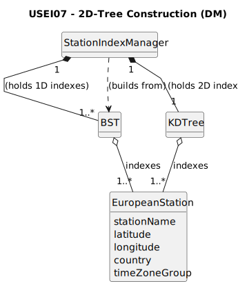

# USEI07 - Build a balanced 2D-Tree on Latitude/Longitude

## 2. Analysis

### 2.1. Relevant Domain Model Excerpt

### 2.2. Other Remarks

* This User Story introduces the `KDTree` class as the primary data structure, which will be held and managed by the `StationIndexManager`.
* To fulfill acceptance criterion AC3 (handling duplicate coordinates), each node in the `KDTree` will function as a "bucket", holding a `List<EuropeanStation>` for all stations that share the exact same (lat, lon) point.