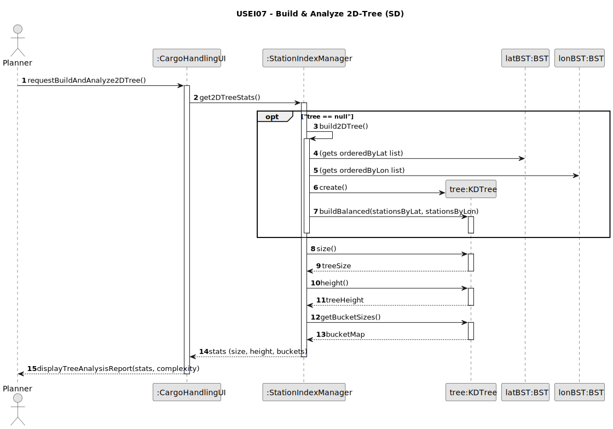
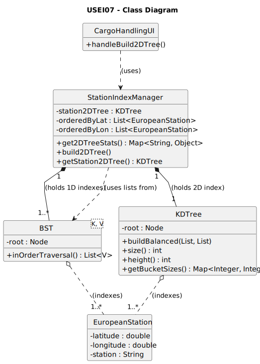

# USEI07 - Build a balanced 2D-Tree on Latitude/Longitude

## 3. Design

### 3.1. Rationale

| Interaction ID | Question: Which class is responsible for... | Answer | Justification (with patterns) |
|:---|:---|:---|:---|
| Step 1 | ... interacting with the actor (Planner)? | `CargoHandlingUI` | **Pure Fabrication:** Handles UI interactions (`handleBuild2DTree`) for this specific task. |
| | ... coordinating the build request and analysis? | `StationIndexManager` | **Controller (or Facade):** Mediates between the UI and the domain/service layer. It's the single point of contact for all indexing services. |
| Step 2 | ... providing the pre-sorted lists from USEI06 (AC2)? | `StationIndexManager` | **Information Expert (IE):** It already holds the `bstLatitude` and `bstLongitude` (or the `List`s derived from them) from the previous US. |
| Step 3 | ... instantiating the `KDTree` object? | `StationIndexManager` | **Creator (Rule 1 / High Cohesion):** The manager is responsible for the *lifecycle* of all index-related data structures. It creates the `BST`s, so it should also create the `KDTree`. |
| Step 4 | ... performing the O(N log N) balanced bulk-build (AC1)? | `KDTree` | **Information Expert / High Cohesion:** The `KDTree` class is the expert on its own internal structure and the algorithm required to build it. |
| | ... handling multiple stations at the same coordinates (AC3)? | `KDTree` (Node) | **IE:** The tree's node logic is responsible for holding a "bucket" (a `List<EuropeanStation>`) for all stations at the same (lat, lon). |
| Step 5 | ... calculating its own statistics (height, size, buckets) (AC4)? | `KDTree` | **Information Expert:** All data required to calculate these metrics is encapsulated within the `KDTree`'s private nodes. |
| Step 6 | ... formatting and displaying the final report (AC4, AC5)? | `CargoHandlingUI` | **IE:** Is responsible for all user-facing interactions and rendering the final report. |

### Systematization

According to the taken rationale, the conceptual classes promoted to software classes are:

* `EuropeanStation`

Other software classes (i.e. Pure Fabrication) identified:

* `CargoHandlingUI` (The UI/View)
* `StationIndexManager` (The Controller/Facade/Service)
* `BST` (Data structure from USEI06)
* `KDTree` (New data structure for USEI07)

## 3.2. Sequence Diagram (SD)

This diagram shows the full sequence of interactions when the user first triggers the `USEI07` analysis.

## 3.3. Class Diagram (CD)

This diagram shows the new `KDTree` class and its relationship with the existing classes from `USEI06`.

