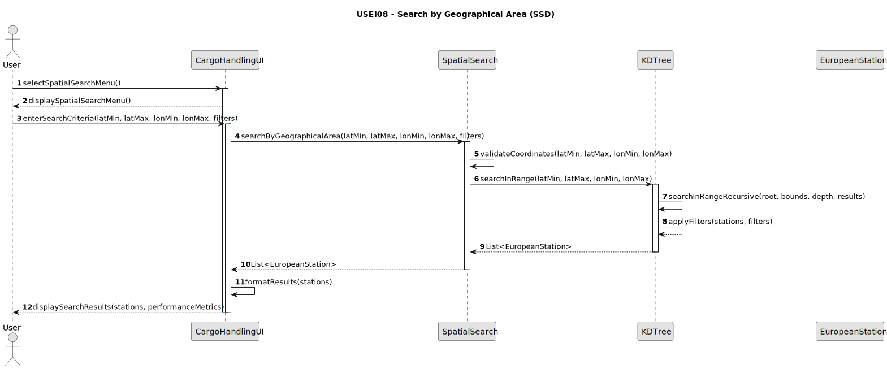

# USEI08 - Search by Geographical Area

## 1. Requirements Engineering

### 1.1. User Story Description

As a planner, I want to query the 2D-tree for all stations in a latitude/longitude range with optional filters, so I can extract relevant stations quickly.

### 1.2. Customer Specifications and Clarifications

**From the specifications document (sem3_pi_2025_26_en.pdf):**

>   Operations need to list all stations inside a map rectangle, optionally filtered by type or country. KD-tree pruning should avoid scanning the whole dataset.
>   The region: lat ∈ [latMin, latMax], lon ∈ [lonMin, lonMax] (inclusive).

### 1.3. Acceptance Criteria

* **AC1:** TThe search must be performed using the balanced 2D-tree built in USEI07, leveraging KD-tree properties to prune search space efficiently.

* **AC2:** The geographical search must accept a rectangular region defined by latitude and longitude boundaries (inclusive ranges).

* **AC3:** The search must support optional filters with the following criteria:
>isCity (true | false)
>
>isMainStation (true | false)
>
>country (PT | ES | all)

* **AC4:** The implementation must return 3-5 sample queries demonstrating the functionality.

* **AC5:** A temporal analysis of the search complexity must be provided.

* **AC6:** The search must handle stations with identical coordinates correctly (all stations at same coordinates should be included if within range).

### 1.4. Found out Dependencies

* Direct dependency on USEI07: Requires the balanced KD-tree built from European railway stations data.
* Dependency on USEI06: Relies on the EuropeanStation data structure and validation.
* Input dependency: Requires the 64k European railway stations dataset loaded and indexed.

### 1.5. Input and Output Data

**Input Data:**

* `LatMin`, `LatMax`: Double values representing latitude boundaries `[-90.0, 90.0]`
* `lonMin`, `lonMax`: Double values representing longitude boundaries `[-180.0, 180.0]`
* `countryFilter`: String (optional) - country code filter (e.g., "PT", "ES", "FR")
* `isCityFilter`: Boolean (optional) - filter for city stations
* `isMainStationFilter`: Boolean (optional) - filter for main stations

**Output Data:**

* `List<EuropeanStation>`: All stations within the geographical rectangle that match the optional filters
* Performance metrics: Execution time and complexity analysis
* Sample query results for demonstration

### 1.6. System Sequence Diagram (SSD)

### 1.7. Technical Specifications

`Algorithm Requirements:`

* Implement recursive range search with KD-tree pruning
* Use depth-based dimension switching (0=latitude, 1=longitude)
* Apply efficient filtering after geographical range check
* Handle edge cases: invalid coordinates, empty results, identical coordinates

`Performance Expectations:`

* Best case: O(log n) - well-balanced tree with good pruning
* Average case: O(√n) - typical for KD-tree range searches
* Worst case: O(n) - when search rectangle covers entire space

### 1.8. Sample Queries Required

`The implementation must demonstrate 3-5 predefined queries such as:`

* 1. All stations in Portugal

* 2. Main stations in Lisbon area

* 3. City stations in France

* 4. Non-main stations in Italy

* 5. All stations in Madrid metropolitan area