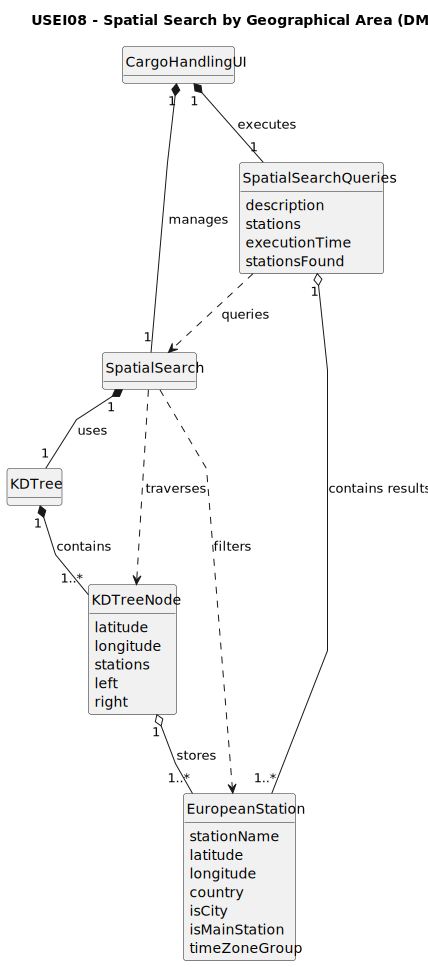

# USEI08 - Search by Geographical Area

## 2. Analysis

### 2.1. Relevant Domain Model Excerpt

### 2.2. System Operations Analysis

**Main Operation:** `searchByGeographicalArea`

**Input:**
- Geographical boundaries (`latMin`, `latMax`, `lonMin`, `lonMax`)
- Optional filters

**Output:**
- List of `EuropeanStation` objects within the specified area matching filters

**Process:**
- Recursive KD-tree traversal with pruning based on spatial boundaries

**Key Responsibilities:**

- **Coordinate Validation:** Ensure geographical boundaries are valid
- **Range Search:** Perform efficient spatial search using KD-tree properties
- **Filter Application:** Apply optional filters (country, city status, main station status)
- **Result Aggregation:** Collect and return matching stations

### 2.3. Domain Concepts

**Core Domain Objects:**

- `SpatialSearch`: Main engine for geographical queries
- `KDTree`: Spatial index structure (built in USEI07)
- `EuropeanStation`: Domain entity representing railway stations
- `SpatialSearchQueries`: Container for query results and performance metrics

**Value Objects:**

- Geographical boundaries (lat/lon ranges)
- Filter criteria (country, station type flags)

### 2.4. Business Rules

**Geographical Validation:**

- Latitude must be within `[-90.0, 90.0]`
- Longitude must be within `[-180.0, 180.0]`
- Minimum boundaries cannot exceed maximum boundaries

**Search Logic:**

- Stations exactly on boundary lines are included (inclusive ranges)
- Multiple stations at identical coordinates are all processed
- Filters are applied after geographical range check

**Performance Requirements:**

- Must leverage KD-tree pruning for efficiency
- Should avoid full dataset scans when possible
- Must handle the ~64k station dataset efficiently

### 2.5. Other Remarks

- This User Story builds upon the KDTree structure created in USEI07, using it for efficient spatial queries
- The `SpatialSearch` class acts as a facade, providing a clean interface for geographical searches
- To handle stations with identical coordinates (from AC6), the search must process all stations within each KD-tree node bucket
- The implementation supports both interactive user queries and predefined demo queries as required by AC4
- Performance monitoring is built-in to satisfy AC5's temporal analysis requirement
