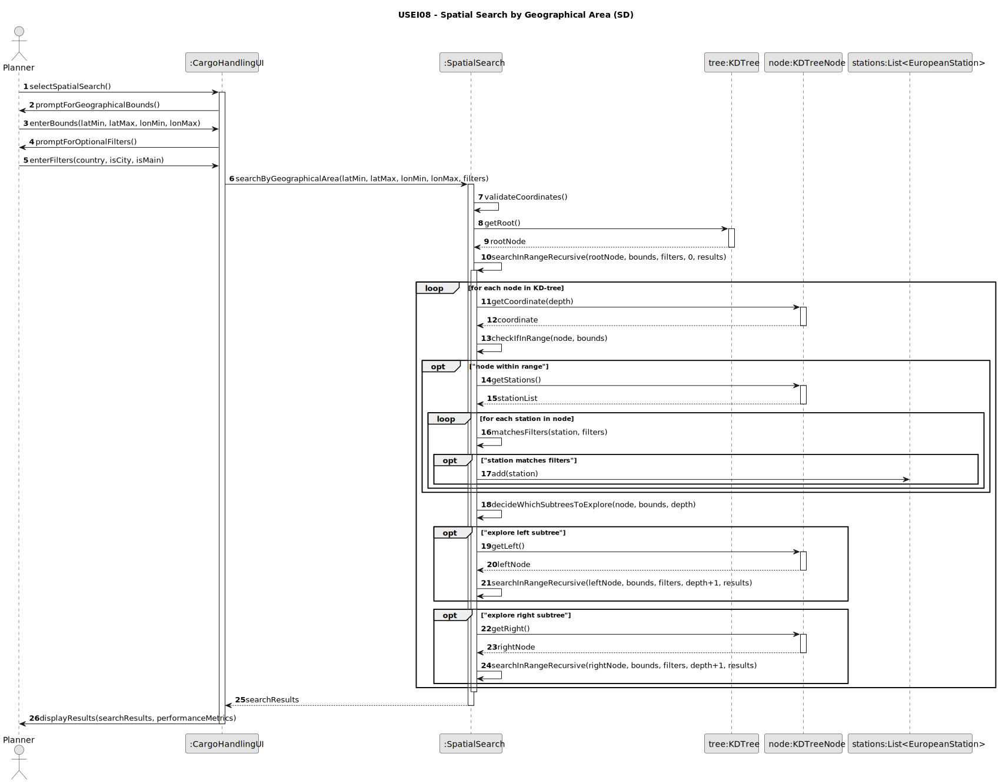
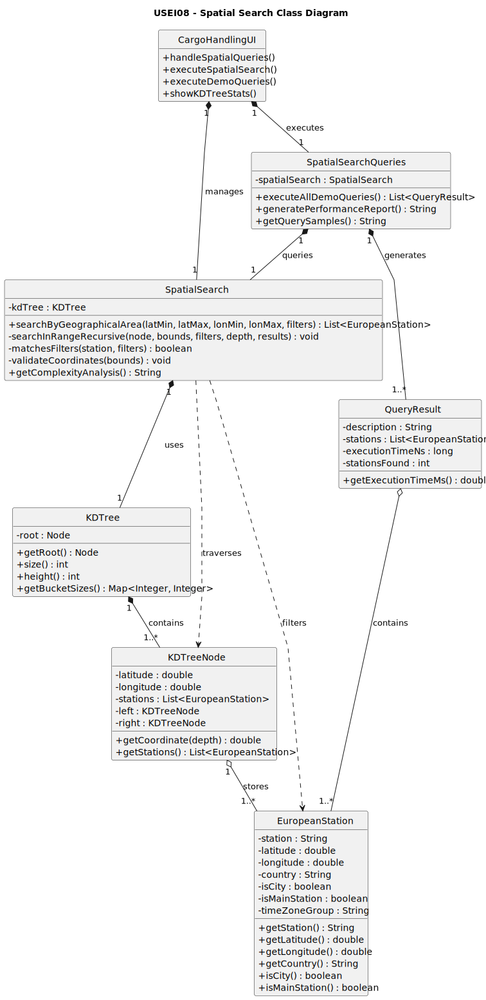

# USEI08 - Search by Geographical Area

## 3. Design

---

## 3.1. Rationale

### Responsibility Assignment Table

| Interaction ID | Question: Which class is responsible for… | Answer | Justification (with patterns) |
|----------------|--------------------------------------------|--------|--------------------------------|
| **Step 1** | … interacting with the actor (Planner)? | **CargoHandlingUI** | *Pure Fabrication*: Handles UI interactions (`handleSpatialQueries`) for spatial search. |
| | … coordinating the spatial search request? | **CargoHandlingUI** | *Controller*: Manages request workflow and user interaction flow. |
| **Step 2** | … validating geographical coordinates? | **SpatialSearch** | *Information Expert (IE)*: Knows coordinate boundaries and validation rules. |
| **Step 3** | … performing the KD-tree range search? | **SpatialSearch** | *IE*: Encapsulates search logic and KD-tree traversal. |
| **Step 4** | … providing access to KD-tree structure? | **KDTree** | *IE*: Owns the tree and provides structure for traversal. |
| **Step 5** | … storing stations with identical coordinates? | **KDTreeNode** | *IE*: Nodes act as buckets holding all stations with same coordinates (AC6). |
| **Step 6** | … applying optional filters (country, city, main station)? | **SpatialSearch** | *IE*: Has access to station attributes and filtering logic. |
| **Step 7** | … executing predefined demo queries (AC4)? | **SpatialSearchQueries** | *Pure Fabrication*: Class for managing and executing sample queries. |
| **Step 8** | … providing performance metrics and complexity analysis (AC5)? | **SpatialSearch** | *IE*: Can analyze performance patterns based on KD-tree traversal. |
| **Step 9** | … displaying results with performance data? | **CargoHandlingUI** | *IE*: Formats and presents results to the user. |

---

### Systematization

**Conceptual classes promoted to software classes:**

- `EuropeanStation`
- `KDTree` *(from USEI07)*
- `KDTreeNode` *(from USEI07)*

**Pure Fabrication classes identified:**

- `CargoHandlingUI` – UI/View layer for spatial queries
- `SpatialSearch` – Facade and engine for spatial search
- `SpatialSearchQueries` – Demo query executor
- `QueryResult` – Container for results + performance metrics

---

## 3.2. Sequence Diagram (SD)

This diagram shows the full sequence of interactions when a user performs a spatial search with optional filters.

---

## 3.3. Class Diagram (CD)

This diagram shows the spatial search classes and their relationships with the existing KD-tree structure from USEI07.

---

## 3.4. Design Patterns Applied

### **Facade Pattern**
`SpatialSearch` simplifies the complex KD-tree traversal and filtering logic for clients.

### **Strategy Pattern**
Filtering logic can be extended with custom strategies without modifying the main search algorithm.

### **Composite Pattern**
`KDTree` and `KDTreeNode` form a hierarchical structure treated uniformly during traversal.

### **Builder Pattern**
`QueryResult` is constructed using a builder-like pattern to progressively attach metrics.

---