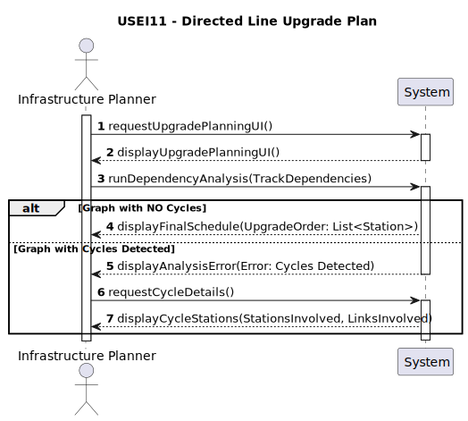

# USEI11 - Directed Line Upgrade Plan

## 1. Requirements Engineering

### 1.1. User Story Description

As an infrastructure planner, I need to compute an ordering of Belgian stations based on the directed track dependencies, so I can schedule station upgrades in an order that respects all directional dependencies; 
and if such an order does not exist because of cycles, I want to see which stations and links are involved in those cycles.

### 1.2. Customer Specifications and Clarifications

**From the specifications document (sem3_pi_2025_26_en.pdf):**

* **Context:** Assume that the directed track dependencies for a specific upgrade or signaling project define a set of directional constraints where a directed edge A→B means: "Before station B can be fully upgraded, its incoming neighbors (like A) must be upgraded first".
* **Goal:** The primary goal is to compute a station ordering that respects all directional dependencies using a Topological Sort algorithm.
* **Analysis Requirement** A report detailing the temporal complexity of the analysis must be provided.

### 1.3. Acceptance Criteria

* **AC1:** The system must model the Belgian track dependencies as a Directed Graph.
* **AC2:** The station ordering must be calculated using a Topological Sort algorithm.
* **AC3:** The solution must include a mechanism for robust Cycle Detection within the dependency graph.
* **AC4:** The temporal analysis complexity of the core graph algorithm (Topological Sort / Cycle Detection) must be explicitly reported.

### 1.4. Found out Dependencies

* Depends on the availability of the dataset containing the Belgian stations and their directed dependency links (the graph structure).
* Depends on the selection and successful implementation of a suitable algorithm for Topological Sort and Cycle Detection (e.g., Kahn’s algorithm or DFS).

### 1.5. Input and Output Data

**Input Data:**

* The Directed Graph representing Belgian Stations (vertices) and Track Dependencies (edges).

**Output Data:**

* A List (or similar structure) containing the determined schedule/order of station upgrades (if successful).
* A Cycle Report (if ordering fails) identifying the stations and links forming the cycles.
* A Temporal Complexity Analysis Report.

### 1.6. System Sequence Diagram (SSD)

### 1.7. Other Relevant Remarks

* This User Story is part of Sprint 3.
* The result provides the Infrastructure Planner with a necessary scheduling order to minimize project delays.
