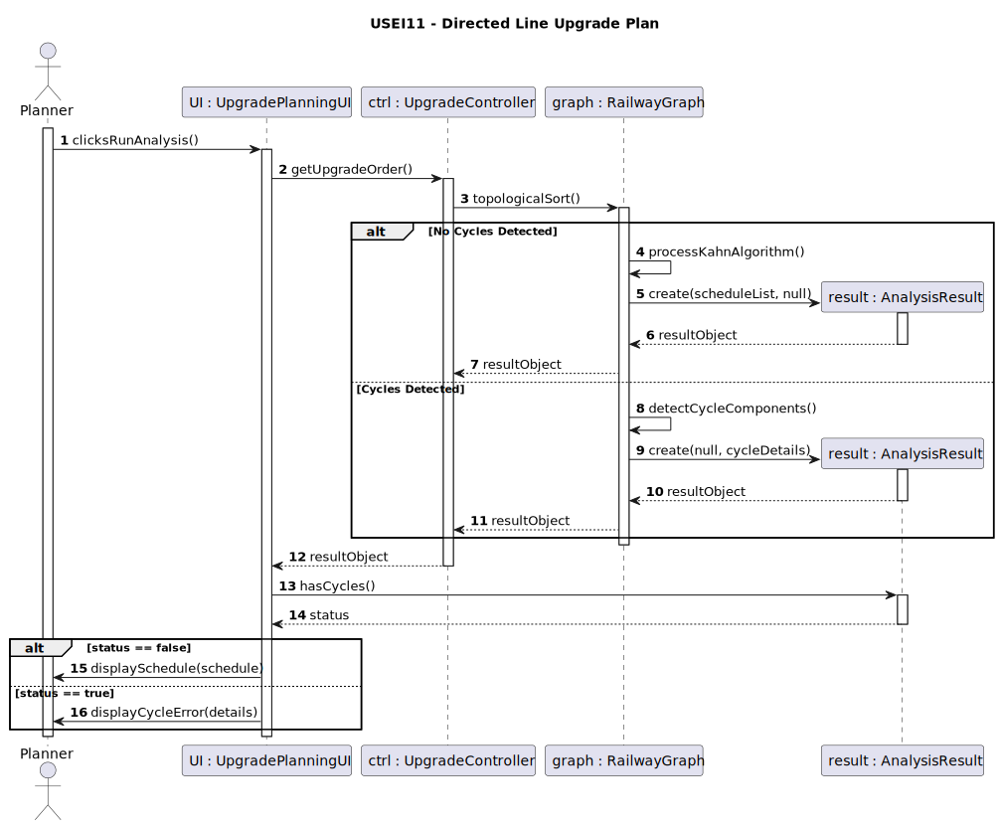
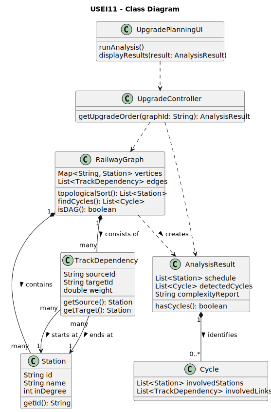

# USEI11 - Directed Line Upgrade Plan

## 3. Design

### 3.1. Rationale

| Interaction ID | Question: Which class is responsible for... | Answer | Justification (with patterns) |
|:---|:---|:---|:---|
| Step 1 | ... interacting with the actor (OperationsPlanner)? | StationSpatialQueryUI | **Pure Fabrication:** Handles UI interactions for spatial queries without domain coupling. |
| | ... coordinating the request for the module? | StationSpatialQueryController | **Controller:** Mediates between the UI and the application/domain layer. |
| | ... holding the 2D-Tree index (built in USEI07)? | StationIndexManager | **Information Expert (IE):** It is the central point of access for all station indexes, including the 2D-tree. |
| Step 2 | ... getting the query parameters (lat, lon, radius) from the Planner? | StationSpatialQueryUI | **IE:** Owns the user input components. |
| | ... dispatching the search request to the correct service? | StationSpatialQueryController | **Controller:** Receives the UI event (`findStationsByRadius`) and calls the appropriate application logic. |
| | ... orchestrating the spatial search operation? | StationIndexManager | **Facade / IE:** Provides a simple interface to the complex subsystem of spatial searching (which involves the 2D-Tree, distance calculation, summarization, and result sorting). |
| | ... performing the actual spatial search on the 2D-Tree? | TwoDTree | **IE:** The data structure itself contains the (recursive) logic for efficient spatial traversal and pruning. |
| | ... calculating the Haversine distance (AC1)? | `HaversineCalculator` (Helper) | **Pure Fabrication:** Encapsulates the complex mathematical formula as a reusable static utility, promoting **High Cohesion**. |
| | ... creating the sorted result tree (AC3, AC4)? | `AVLTree` | **IE:** This is the specified data structure for the output. Its insertion logic maintains the required sort order. |
| | ... creating the `StationDistanceResult` wrappers (for sorting)? | StationIndexManager | **Creator (Rule 4):** Has the data (Station and calculated distance) needed to initialize the `StationDistanceResult` objects. |
| | ... creating the `DensitySummary` object (AC5)? | `DensitySummaryService` (Helper) | **Pure Fabrication / High Cohesion:** A dedicated class to iterate the raw results and aggregate them into the summary object. |
| Step 3 | ... notifying the Planner of the results (tree + summary)? | StationSpatialQueryUI | **IE:** Is responsible for all user-facing interactions and rendering the final results. |

### Systematization

According to the taken rationale, the conceptual classes promoted to software classes are:

* **EuropeanStation**

Other software classes (i.e. Pure Fabrication) identified:

* **StationSpatialQueryUI** (Boundary)
* **StationSpatialQueryController** (Controller)
* **StationIndexManager** (Facade / Manager)
* **HaversineCalculator** (Helper/Utility)
* **DensitySummaryService** (Service/Helper)
* **TwoDTree** (Data Structure, from USEI07)
* **AVLTree** (Data Structure, for results)
* **StationDistanceResult** (DTO - Data Transfer Object)
* **DensitySummary** (DTO)

## 3.2. Sequence Diagram (SD)

### Full Diagram

This diagram shows the full sequence of interactions between the classes involved in the realization of this user story.

## 3.3. Class Diagram (CD)

