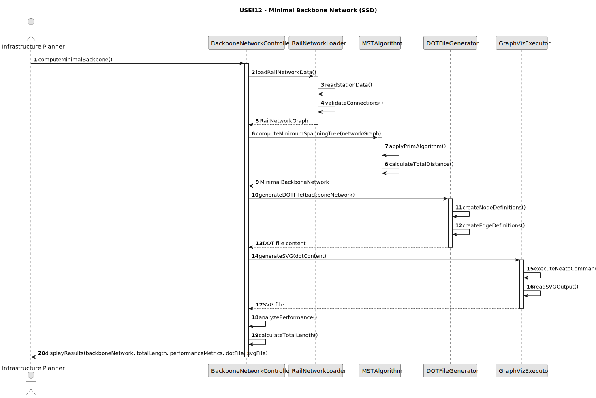

# USEI12 — Minimal Backbone Network

## 1. Requirements Engineering

### 1.1. User Story Description

As an infrastructure planner, I want to compute a minimum network over the rail network (treated as undirected) so that I can identify a minimal backbone that connects all stations with minimum total track length.

### 1.2. Customer Specifications and Clarifications

**From the specifications document (sem3_pi_2025_26_en.pdf):**

> To estimate a cost baseline for maintenance or expansion, it is necessary to have a minimal track subset that connects all reachable stations.

### 1.3. Acceptance Criteria

* **AC1:** The solution must compute a Minimum Spanning Tree (MST) over the Belgian rail network treated as an undirected graph.

* **AC2:** The implementation must use Prim's or Kruskal's algorithm to find the minimal backbone network.

* **AC3:** The MST must connect all reachable stations in the network with minimum total track length.

* **AC4:** The result must be transformed into a DOT file representation for visualization.

* **AC5:** An SVG file must be generated using the GRAPHVIZ "neato" application for easy visualization of the backbone network.

* **AC6:** Each vertex in the DOT/SVG output must be placed at its XY coordinates to resemble the Belgium train global map.

* **AC7:** A temporal analysis of the algorithm complexity must be provided.

* **AC8:** The implementation must handle disconnected components appropriately (generate separate MSTs for each connected component).

### 1.4. Found out Dependencies

* Direct dependency on Belgian rail network dataset (station-to-station connections with distances)
* Input dependency: Requires station coordinates (XY) for proper visualization
* Requires GraphViz "neato" application for SVG generation
* Builds upon graph classes studied in the course (Graph, Vertex, Edge)

### 1.5. Input and Output Data

**Input Data:**
* `station_to_station.csv`: Belgian rail network data with:
    - `stationFrom_name`: Origin station name
    - `stationTo_name`: Destination station name
    - `distance`: Connection distance in kilometers
* Station coordinates dataset with XY positions for visualization

**Output Data:**
* `MinimalBackboneNetwork`: Graph object representing the MST
* `backbone.dot`: DOT file representation of the backbone network
* `backbone.svg`: Visual representation generated by neato
* Performance metrics: Execution time and complexity analysis

### 1.6. System Sequence Diagram (SSD)

### 1.7. Technical Specifications

**Algorithm Requirements:**
* Implement Prim's algorithm (preferred) or Kruskal's algorithm for MST
* Use adjacency list or matrix representation for the rail network graph
* Handle weighted edges (distances) as double values
* Support undirected graph operations

**Visualization Requirements:**
* Generate DOT file compliant with GraphViz specifications
* Use neato layout engine for force-directed placement
* Include station coordinates for accurate positioning
* Label edges with distances

**Performance Expectations:**
* Best case: O(E log V) for Prim's algorithm with Fibonacci heap
* Average case: O(E log V) for Prim's algorithm with binary heap
* Worst case: O(E log V) for dense graphs

### 1.8. Expected Results Format

**The implementation must produce:**
1. A graph object representing the minimal backbone network
2. A DOT file that can be rendered by GraphViz
3. An SVG visualization similar to Belgium train map
4. Performance analysis report
5. Total track length of the backbone network