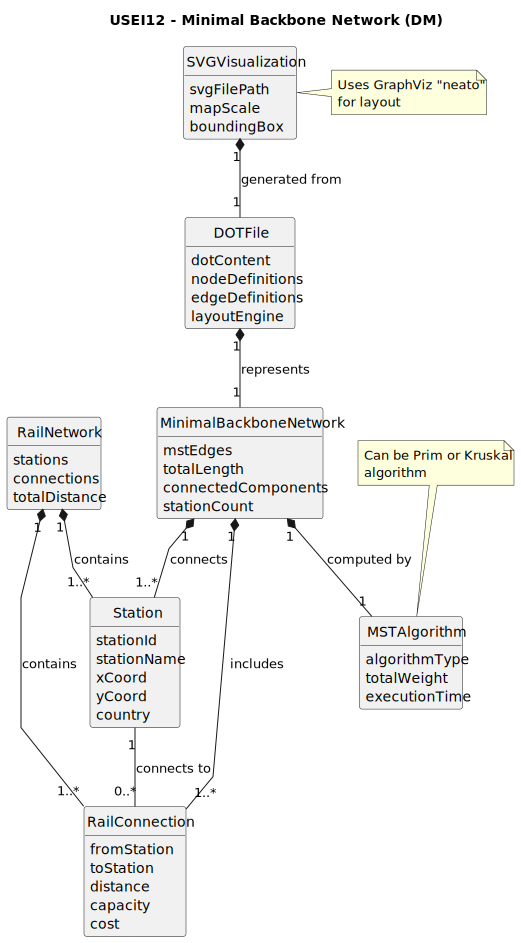

# USEI12 — Minimal Backbone Network

## 2. Analysis

### 2.1. Relevant Domain Model Excerpt

### 2.2. System Operations Analysis

**Main Operation:** `computeMinimalBackbone`

**Input:**
- Rail network graph (stations as vertices, connections as weighted edges)
- Station coordinates for visualization

**Output:**
- Minimal Spanning Tree graph
- DOT file representation
- SVG visualization

**Process:**
1. Load Belgian rail network data
2. Apply MST algorithm (Prim/Kruskal)
3. Generate DOT file with coordinates
4. Execute neato to produce SVG
5. Calculate total backbone length

**Key Responsibilities:**

- **Graph Processing:** Load and validate rail network data
- **MST Computation:** Apply efficient minimum spanning tree algorithm
- **Visualization:** Generate DOT and SVG files with proper layout
- **Performance Analysis:** Measure and report algorithm efficiency

### 2.3. Domain Concepts

**Core Domain Objects:**

- `RailNetwork`: Complete Belgian rail network graph
- `MinimalBackboneNetwork`: MST result graph
- `Station`: Railway station with name and coordinates
- `RailConnection`: Weighted edge between stations (distance)
- `DOTGenerator`: Creates GraphViz DOT file representation
- `SVGVisualizer`: Manages SVG generation through neato

**Value Objects:**

- Coordinates (X, Y position)
- Distance (kilometers)
- Algorithm metrics (time, complexity)

### 2.4. Business Rules

**Graph Construction Rules:**
- Network must be treated as undirected for MST computation
- Distances must be positive values
- Disconnected components require separate MSTs
- Stations must have valid coordinates for visualization

**MST Algorithm Rules:**
- Must minimize total track length
- Must connect all reachable stations
- Must maintain graph connectivity
- Must handle multiple connected components

**Visualization Rules:**
- DOT file must follow GraphViz language specification
- Coordinates must be preserved for accurate map resemblance
- SVG output should resemble official Belgium train map layout
- Edge labels must show distances

**Performance Requirements:**
- Must handle ~400 stations and ~500 connections efficiently
- Should scale appropriately with network size
- Must provide complexity analysis

### 2.5. Other Remarks

- This User Story focuses on infrastructure planning rather than operational scheduling
- The "minimal backbone" concept is analogous to telecommunications network design
- Visualization is crucial for stakeholder communication and decision-making
- The DOT/SVG generation serves both technical and presentation purposes
- Performance analysis must consider both computational and I/O aspects