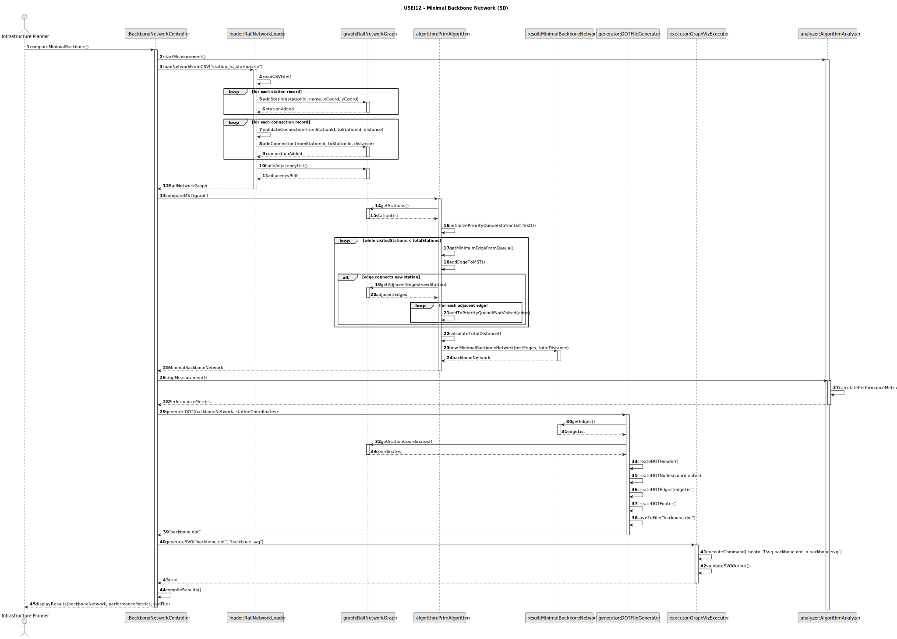
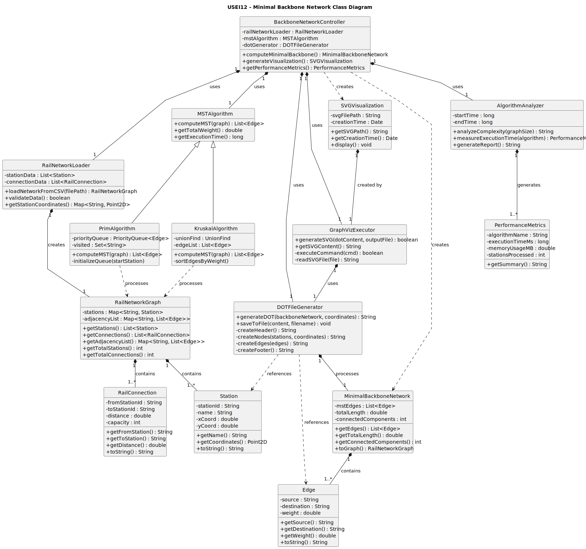

# USEI12 — Minimal Backbone Network

## 3. Design

---

## 3.1. Rationale

### Responsibility Assignment Table

| Interaction ID | Question: Which class is responsible forŌĆ” | Answer | Justification (with patterns) |
|----------------|--------------------------------------------|--------|--------------------------------|
| **Step 1** | ŌĆ” loading the Belgian rail network data? | **RailNetworkLoader** | *Pure Fabrication*: Specialized class for data loading and validation. |
| **Step 2** | ŌĆ” representing the complete rail network? | **RailNetworkGraph** | *Information Expert (IE)*: Encapsulates graph structure and operations. |
| **Step 3** | ŌĆ” computing the Minimum Spanning Tree? | **MSTAlgorithm** | *Strategy Pattern*: Can implement Prim or Kruskal algorithms. |
| **Step 4** | ŌĆ” storing the backbone network result? | **MinimalBackboneNetwork** | *IE*: Specialized graph for MST results. |
| **Step 5** | ŌĆ” generating DOT file representation? | **DOTFileGenerator** | *Pure Fabrication*: Knows GraphViz DOT format specifications. |
| **Step 6** | ŌĆ” executing GraphViz neato command? | **GraphVizExecutor** | *Facade Pattern*: Simplifies external tool interaction. |
| **Step 7** | ŌĆ” calculating total backbone length? | **BackboneAnalyzer** | *IE*: Can traverse MST and compute metrics. |
| **Step 8** | ŌĆ” providing performance analysis? | **AlgorithmAnalyzer** | *Pure Fabrication*: Measures and reports complexity metrics. |
| **Step 9** | ŌĆ” coordinating the entire process? | **BackboneNetworkController** | *Controller*: Orchestrates the workflow. |

---

### Systematization

**Conceptual classes promoted to software classes:**
- `Station` (from rail network domain)
- `RailConnection` (edge with distance)
- `RailNetworkGraph` (complete network)

**Pure Fabrication classes identified:**
- `RailNetworkLoader` ŌĆō Data loading and validation
- `MSTAlgorithm` ŌĆō MST computation strategies
- `DOTFileGenerator` ŌĆō GraphViz DOT file creation
- `GraphVizExecutor` ŌĆō External tool integration
- `BackboneAnalyzer` ŌĆō Result analysis and metrics
- `BackboneNetworkController` ŌĆō Process coordination
- `AlgorithmAnalyzer` ŌĆō Performance measurement

---

## 3.2. Sequence Diagram (SD)

This diagram shows the complete workflow for computing and visualizing the minimal backbone network.

---

## 3.3. Class Diagram (CD)

This diagram shows the core classes for MST computation and visualization.

---

## 3.4. Design Patterns Applied

### **Strategy Pattern**
`MSTAlgorithm` can switch between Prim and Kruskal implementations without changing client code.

### **Facade Pattern**
`GraphVizExecutor` provides a simple interface to the complex GraphViz toolchain.

### **Composite Pattern**
`RailNetworkGraph` treats stations and connections uniformly as vertices and edges.

### **Builder Pattern**
`DOTFileGenerator` constructs DOT files incrementally with proper formatting.

### **Observer Pattern**
`AlgorithmAnalyzer` monitors algorithm execution and collects performance metrics.

### **Template Method**
`BackboneNetworkController` defines the skeleton of the algorithm while allowing steps to vary.

---