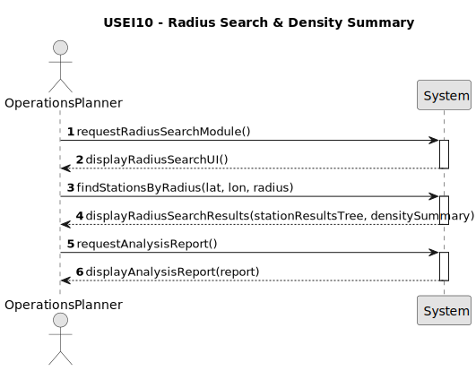

# USEI10 - Radius search and density summary

## 1. Requirements Engineering

### 1.1. User Story Description

As a maintenance planner, I want to compute centrality measures for each station in the railway network — namely betweenness, harmonic closeness, and degree/strength — and combine them into a composite HubScore (normalised and weighted), so I can rank and export the network’s most critical hub stations for decision-making.

### 1.2. Customer Specifications and Clarifications

* **Context:** Rail operations rely on a limited number of hub stations that concentrate transfers, connect regions, and act as chokepoints. Quantitative identification of these hubs is essential for:

* capacity planning,
* robustness and failure impact analysis,
* prioritisation of infrastructure upgrades.

* **Network Model:** The railway network is modelled as a graph, where:

* nodes represent stations,
* edges represent railway connections between stations.

* **Centrality Metrics:** 

* Degree / Strength: Measures direct connectivity (number of connections or sum of edge weights).
* Betweenness Centrality: Measures how often a station lies on shortest paths between other stations.
* Harmonic Closeness Centrality: Measures accessibility, accounting for disconnected components.

### 1.3. Acceptance Criteria

* **AC1:** The system must compute degree and strength for every station based on the network graph.
* **AC2:** The system must compute betweenness centrality using shortest-path analysis over the graph.
* **AC3:** The system must compute harmonic closeness centrality, correctly handling unreachable nodes.
* **AC4:** Each centrality component must be normalised to the range [0,1].
* **AC5:** The system must compute a composite HubScore using the predefined weighted formula.
* **AC6:** The result must allow ranking of stations by HubScore (DESC).
* **AC7:** A temporal complexity analysis of the implemented algorithms must be provided.

### 1.4. Found out Dependencies

* Depends on the availability of the railway network graph, including stations and connections.
* Depends on previously implemented graph data structures and shortest-path algorithms (e.g. BFS/Dijkstra).
* Depends on the correct loading and identification of station identifiers (stid, stname).

### 1.5. Input and Output Data

**Input Data:**

* The complete railway network graph:
* stations (nodes),
* connections (edges, weighted or unweighted).
* Optional configuration of HubScore weights (default values must be applied if not provided).

**Output Data:**

* A data structure (e.g. list, table, or BST/AVL) containing one entry per station with:
* stid, stname
* degree, strength
* betweenness
* harmonicCloseness
* hubscore
* A ranked view of stations by HubScore (DESC).
* A temporal complexity analysis report.

### 1.6. System Sequence Diagram (SSD)

### 1.7. Other Relevant Remarks

* This User Story focuses on network-wide analysis, not on individual station queries.
* Normalisation must be performed per metric across all stations.
* Harmonic closeness is mandatory instead of classic closeness to correctly handle disconnected graphs.