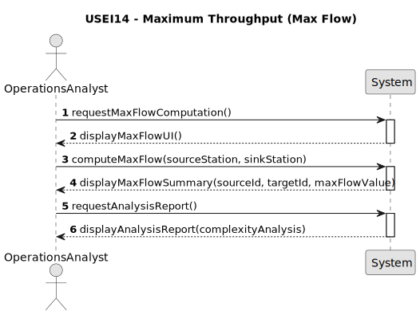

hp# USEI14 - Maximum throughput between two Hubs

## 1. Requirements Engineering

### 1.1. User Story Description

As an operations analyst, I want to compute the maximum flow between two selected stations (source and sink), given per-edge capacities, so I can estimate the corridor's theoretical throughput.

### 1.2. Customer Specifications and Clarifications

**From the specifications document (sem3_pi_2025_26_en_3_2.pdf):**

* **Context:** Major hubs' effectiveness is reliant on the connecting corridors, and due to limited track capacity, it is crucial for planners to understand the maximum possible throughput between hubs.  
  This understanding aids in validating schedules, recognizing bottlenecks, and prioritizing upgrades.
* **Dataset:** The goal of this sprint is to implement functionalities using the **Belgian rail network** for testing.
* **Graph Structure:**
  * **Node (Station, terminal, Freight yard):** A unique location defined by its name, node id, geographic coordinates, and XY coordinates.
  * **Edge:** A connection between two node stations that has specific measures, specifically **capacity**.
  * **Capacity:** Represents the maximum flow of trains the connection can handle per planning day.

### 1.3. Acceptance Criteria

* **AC1:** The system must compute the **maximum flow** between two selected stations (source and sink).
* **AC2:** The calculation must utilize the **per-edge capacities** defined in the network.
* **AC3:** The expected return is a summary containing strictly: **source stid**, **target stid**, and the **maxFlow Value**.
* **AC4:** A **temporal analysis complexity** report must be provided.

### 1.4. Found out Dependencies

* Depends on the implementation of the **Belgian rail network** using the studied graph classes.
* Depends on the existence of the `capacity` measure in the edge data structure.
* Depends on the Graph Theory algorithms studied in the course (specifically Maximum Flow algorithms).

### 1.5. Input and Output Data

**Input Data:**

* Source Station (station ID or object).
* Sink/Target Station (station ID or object).
* The graph representing the railway network with edge capacities.

**Output Data:**

* **maxflow.summary:** A structured output containing `source stid`, `target stid`, and `maxFlow Value`.
* A temporal complexity analysis report.

### 1.6. System Sequence Diagram (SSD)

### 1.7. Other Relevant Remarks

* This User Story is part of **Sprint 3 - Railway Network Optimization**.
* By calculating the maximum flow, planners can establish a credible upper limit on train routing per day.
* Common algorithms for this problem include **Edmonds-Karp** or **Ford-Fulkerson**.
