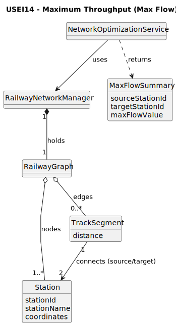

# USEI14 - Maximum throughput between two Hubs

## 2. Analysis

### 2.1. Relevant Domain Model Excerpt

### 2.2. Other Remarks

* **Capacity Attribute:** Unlike other network optimizations (which use distance or cost), this User Story strictly utilizes the `capacity` attribute of the edges (connections) as the weight/constraint for the flow calculation.
* **Algorithm:** The implementation requires a specific Maximum Flow algorithm (such as **Edmonds-Karp** or **Ford-Fulkerson**) that operates on the graph structure to determine the bottleneck capacity between the source and sink.
