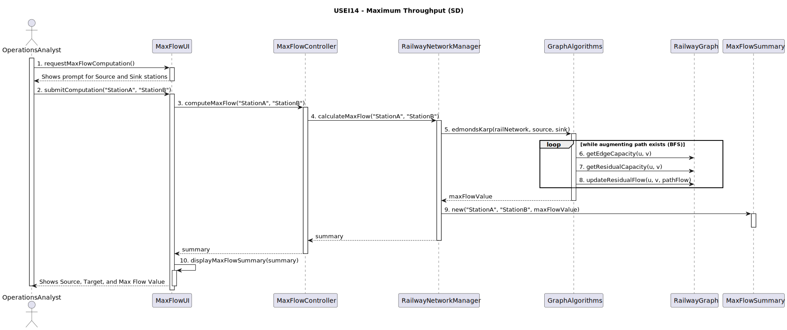
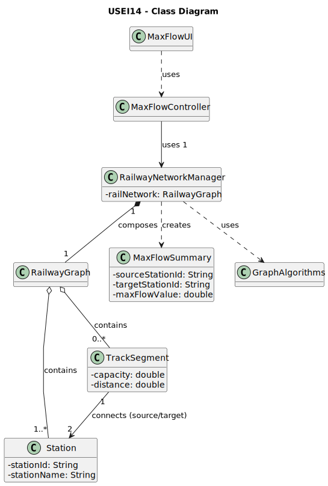

# USEI14 - Maximum throughput between two Hubs

## 3. Design

### 3.1. Rationale

| Interaction ID | Question: Which class is responsible for... | Answer | Justification (with patterns) |
|:---|:---|:---|:---|
| Step 1 | ... interacting with the actor (OperationsAnalyst)? | MaxFlowUI | **Pure Fabrication:** Handles UI interactions for flow calculations without domain coupling. |
| | ... coordinating the request for the calculation? | MaxFlowController | **Controller:** Mediates between the UI and the application/domain layer. |
| | ... holding the Graph structure (Belgian Network)? | RailwayNetworkManager | **Information Expert (IE):** It is the central point of access for the graph data structure containing stations and tracks. |
| Step 2 | ... getting the query parameters (Source, Sink) from the Analyst? | MaxFlowUI | **IE:** Owns the user input components. |
| | ... dispatching the calculation request to the correct service? | MaxFlowController | **Controller:** Receives the UI event (`computeMaxFlow`) and calls the appropriate application logic. |
| | ... orchestrating the max flow calculation? | RailwayNetworkManager | **Facade / IE:** Provides a simple interface to the complex subsystem of graph algorithms. It knows the current state of the network. |
| | ... executing the specific Max Flow algorithm (e.g., Edmonds-Karp)? | `GraphAlgorithms` (Utility) | **Pure Fabrication:** Encapsulates the complex algorithmic logic (BFS, residual graph management) as a reusable static utility, promoting **High Cohesion**. |
| | ... accessing the edge capacity (AC2)? | `TrackSegment` (Edge) | **IE:** The edge object knows its own attributes, specifically the `capacity` limit. |
| | ... creating the `MaxFlowSummary` object (AC3)? | RailwayNetworkManager | **Creator (Rule 4):** Has the data (Source ID, Target ID, and the calculated value) needed to initialize the summary object. |
| Step 3 | ... notifying the Analyst of the results? | MaxFlowUI | **IE:** Is responsible for all user-facing interactions and rendering the final summary. |

### Systematization

According to the taken rationale, the conceptual classes promoted to software classes are:

* **Station**
* **TrackSegment** (Edge)
* **RailwayGraph** (The graph structure)

Other software classes (i.e. Pure Fabrication) identified:

* **MaxFlowUI** (Boundary)
* **MaxFlowController** (Controller)
* **RailwayNetworkManager** (Facade / Manager)
* **GraphAlgorithms** (Helper/Utility - implements Edmonds-Karp)
* **MaxFlowSummary** (DTO - Data Transfer Object)

## 3.2. Sequence Diagram (SD)

### Full Diagram

This diagram shows the full sequence of interactions between the classes involved in the realization of this user story.

## 3.3. Class Diagram (CD)

