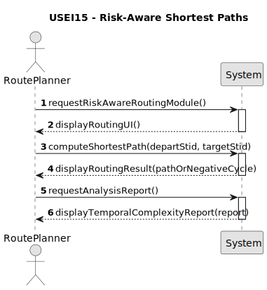

# USEI10 - Radius search and density summary

## 1. Requirements Engineering

### 1.1. User Story Description

As a route planner, I want to compute the shortest path between two stations using an edge cost that combines distance and penalties/bonuses, and detect whether an inconsistent configuration (negative cycle) exists in the network, so I can propose robust routes or flag configuration errors.

### 1.2. Customer Specifications and Clarifications

* **Context:** Some railway connections may be slower, constrained, or less reliable due to maintenance works or operational limitations. Conversely, certain links may be highly preferred. These factors are modelled as penalties or bonuses applied to each connection.

* **Cost Model:** Each edge has a composite cost, combining:
* physical distance,
* operational penalties or bonuses.

  * The resulting cost may be negative.

* **Alghoritmic Constraint:** 
* Because negative edge weights are allowed, Dijkstra’s algorithm is not suitable.
* The system must use an algorithm capable of:

* computing shortest paths with negative weights,
* detecting negative cycles.

### 1.3. Acceptance Criteria

* **AC1:** The system must compute the shortest path between a departure station and a target station using the composite edge cost.
* **AC2:** The system must support negative edge costs.
* **AC3:** The system must detect the existence of negative cycles reachable from the departure station.
* **AC4:** If a negative cycle is detected, the system must return:
* the stations involved in the cycle,
* the edges forming the cycle
* **AC5:** If no negative cycle exists, the system must return:
* the ordered list of stations along the shortest path,
* the cumulative cost at each step,
* the total cost to the target station.
* **AC6:** The shortest-path result must be clearly distinguishable from the negative-cycle result.
* **AC7:** A temporal complexity analysis of the chosen algorithm must be provided.

### 1.4. Found out Dependencies

* Depends on the availability of the railway network graph, including: stations (nodes), connections (edges with composite costs).
* Depends on previously implemented graph traversal and shortest-path algorithms.
* Depends on consistent identification of station IDs (stid).

### 1.5. Input and Output Data

**Input Data:**

* Departure station identifier (departStid).
* Target station identifier (targetStid).
* Railway network graph with composite edge costs (distance + penalty/bonus).

**Output Data:**

* If no negative cycle is detected:
* The shortest path represented
* Total cost to the target station.

* If a negative cycle is detected:
List of stations involved in the negative cycle.
List of edges forming the cycle.

* A temporal complexity analysis report.

### 1.6. System Sequence Diagram (SSD)

### 1.7. Other Relevant Remarks

* This User Story requires the use of a shortest-path algorithm supporting negative weights. 
* Negative cycle detection is mandatory and has priority over path computation.
* The analysis may be computationally expensive and is suitable for offline or controlled execution.
* Clear separation between valid route results and configuration error results is required.