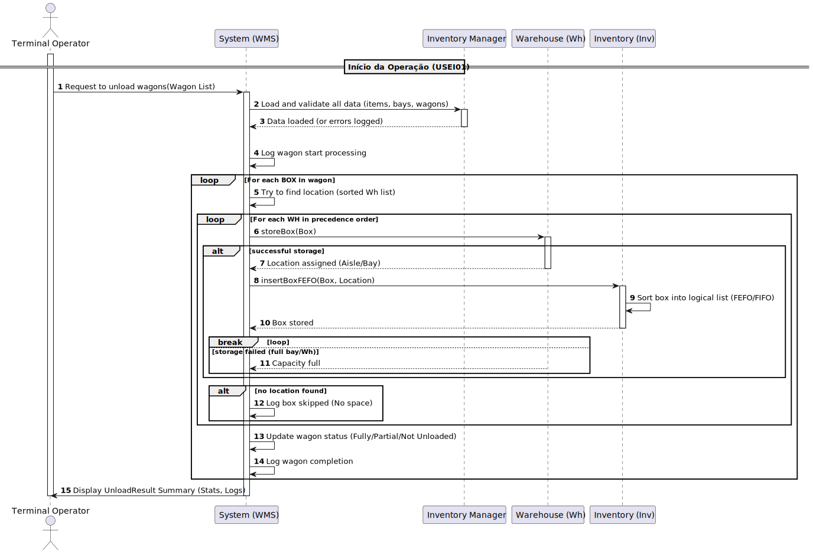

# 🚂 USLP07 - Freight Dispatching and Conflict Resolution

## 1. Requirements Engineering

### 1.1. User Story Description

As a **Freight Manager**, I want to use a **scheduler** that allows me to dispatch a list of trains, where each train has an associated route, so that I can **calculate the estimated travel times** and **resolve potential single-track conflicts** before execution.

---

### 1.2. Customer Specifications and Clarifications

The scheduler is responsible for modeling the railway operations. It must calculate the journey time segment by segment, considering both the track limits and the train's dynamic performance. Crucially, it must handle single-track operations by forcing one train to wait at a preceding safe point.

| Conceito | Fonte (Enunciado/Código) | Detalhe |
| :--- | :--- | :--- |
| **Cálculo da Velocidade** | USLP07 / `SchedulerService` | The travel speed is the **minimum** between the line segment's speed limitation (`Vseg`) and the calculated maximum speed of the train (`Vmax_train`). |
| **Vmax do Comboio** | USLP07 / `SchedulerService` | $V_{max\_train}$ is calculated dynamically based on the **combined power** of the locomotives and the **total weight** of the wagons (tare + load). |
| **Rota e Despacho** | USLP07 | The route for each train is initially defined **manually** by the Freight Manager. The dispatch process begins with the list of trains sorted by their planned departure time. |
| **Conflito (Via Única)** | USLP07 / `SchedulerService` | A conflict occurs when two trains attempt to use the same **physical single-track segment** concurrently (i.e., the prioritized train's exit time is after the subsequent train's entry time). |
| **Resolução de Conflitos** | USLP07 / `SchedulerService` | The subsequent train must yield and wait at the **last safe waiting point** (a station or a double-track segment) preceding the conflict point. The required delay must be the **minimum necessary**. |
| **Resultados** | USLP07 | The system must indicate the **estimated passage times** at various points along the route and detail the necessary **crossing operations** (resolved conflicts). |

---

### 1.3. Acceptance Criteria

* **AC1 (Sorting):** Trains are processed in **ascending order** of their planned departure time.
* **AC2 (Performance Calculation):** The effective speed in each segment (`Veffective`) is calculated as $\min(V_{line}, V_{max\_train})$.
* **AC3 (Conflict Detection):** Conflicts are detected on shared single-track segments when the prioritizing train (`Trip A`) has not cleared the segment by the time the subsequent train (`Trip B`) attempts to enter.
* **AC4 (Conflict Resolution):** The subsequent train (`Trip B`) is delayed (`delayMinutes`) and held at the `findLastSafeWaitingPointId` (double-track facility). The route and times for `Trip B` must be **recalculated** starting from the new departure time.
* **AC5 (Output):** The system returns the final list of scheduled trips with updated passage times, and a list of resolved conflicts (`Conflict` objects) detailing the waiting station and delay imposed.

---

### 1.4. Domain Model and Dependencies

The scheduling service relies on the correct implementation of the domain model for rail physics and network geometry:

* **`TrainTrip`:** Holds the input data (`Locomotives`, `Wagons`, `Route`) and stores the simulation results (`SimulationSegmentEntry`).
* **`LineSegment`:** Provides critical path data, including `length_km` and `numberTracks` (for single-track detection).
* **`Locomotive` / `Wagon`:** Provides dynamic data (`powerKw`, `totalWeightKg`) for performance calculations.
* **`SegmentLineRepository`:** Essential for identifying the shared *physical* segment between two trips, even if one trip uses the inverse ID (`INV_` prefix).
* **`SchedulerService`:** Implements the simulation, time calculation, and conflict resolution logic.

---

### 1.5. Input and Output Data

| Data Flow | Fonte/Estrutura | Detalhe |
| :--- | :--- | :--- |
| **Input (Trips)** | `List<TrainTrip>` (initial data) | List of trips to be scheduled, sorted by `DepartureTime` (AC1). |
| **Output (Principal)** | `SchedulerResult` | Contains `List<TrainTrip>` (final scheduled trips with delays) and `List<Conflict>` (resolved conflicts). |
| **Output (Simulation)** | `TrainTrip.getSegmentEntries()` | `List<SimulationSegmentEntry>` detailing segment entry/exit times, allowed speed, and calculated speed. |
| **Output (Conflitos)** | `Conflict` DTO | `tripId1`, `tripId2`, `delayMinutes`, `scheduledMeetTime` (safe entry time), `safeWaitFacilityId`. |

---
### 1.6. System Sequence Diagram (SSD)

## 2. Technical Implementation Details

### 2.1. Dynamic Performance Calculation

The `SchedulerService` calculates $V_{max\_train}$ (the train's maximum speed based on its power-to-weight ratio) and then determines the effective speed for each segment $V_{effective}$.

$$V_{max\_train} = \min \left( MAX\_FREIGHT\_SPEED\_CAP, \frac{P_{total} \times POWER\_TO\_TRACTION\_FACTOR}{W_{total} / 1000} \right)$$

Where $P_{total}$ is the combined locomotive power (kW) and $W_{total}$ is the total weight (kg) of the rolling stock and cargo.

The effective speed for any segment is capped by the line's own limit:
$$V_{effective} = \min (V_{max\_train}, V_{max\_segment})$$

### 2.2. Conflict Resolution Algorithm (`SchedulerService.dispatchTrains`)

The process uses a cascading simulation approach :

1.  **Prioritization (AC1):** All trains are sorted by their original `DepartureTime`.
2.  **Initial Run:** Each `TrainTrip` runs through `calculateTravelTimes` to establish initial `EntryTime` and `ExitTime` for all segments.
3.  **Conflict Check (AC3 & AC4):** The algorithm iterates over pairs of trips (Trip A as priority, Trip B as subsequent).
  * It identifies segments where both Trip A and Trip B use the **same underlying physical track ID**.
  * If **$ExitTime_A > EntryTime_B$** on a single track, a conflict is confirmed.
4.  **Impose Delay:**
  * The minimum delay required for Trip B is calculated: $\text{Delay}_{\text{min}} = \lceil (\text{ExitTime}_A - \text{EntryTime}_B) \text{ in minutes} \rceil + 1 \text{ minute buffer}$.
  * The **`findLastSafeWaitingPointId`** method determines the facility ID where Trip B must wait (a preceding double-track facility or station).
  * Trip B's departure is updated: $NewDepartureTime_B = OriginalDepartureTime_B + \text{Delay}_{\text{min}}$.
5.  **Recalculation:** Trip B's entire route and segment entries are **recalculated** based on the new (delayed) departure time. This delayed trip replaces the original in the schedule, ensuring cascading conflicts are properly handled.
6.  **Final Output (AC5):** The system returns the final scheduled list and the detailed `Conflict` objects.
