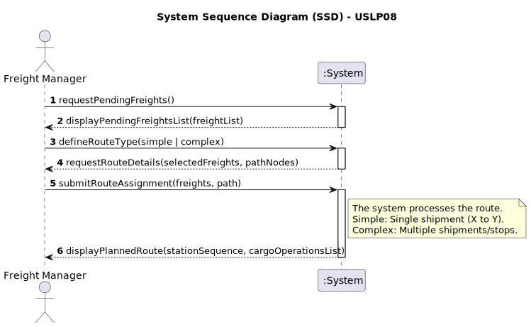

# 🚂 USLP07 - Freight Dispatching and Conflict Resolution

## 1. Requirements Engineering

### 1.1. User Story Description

As a Fleet Manager, I want to register a new electric locomotive model in the system so that it can be correctly integrated into the fleet and used in future train scheduling and performance simulations.

---

### 1.2. Customer Specifications and Clarifications

* The system must store technical specifications such as: model name, maximum traction power, maximum speed, and energy consumption profile.

* Since it is an electric locomotive, it must be linked to the available electrification standards (e.g., 25kV AC).

* Data integrity must be ensured at the database level.

---

### 1.3. Acceptance Criteria

* **AC1** The model must have a unique identifier, so the system must prevent the registration of two models with the same identifier.
* **AC2** All technical fields must be validated (non-negative values).
* **AC3** The information must be persisted in the remote database via a PL/SQL function.
* **AC4** The system must clearly distinguish between Electric, Diesel, and Steam models, applying specific fields for the electric type.

---

### 1.4. Domain Model and Dependencies

The registration of a locomotive model is a prerequisite for fleet management and simulation modules:

* **`LocomotiveModel`:** Stores common attributes like name, manufacturer, maxTractionPower, and maxSpeed.
* **`ElectricLocomotiveModel`:** Adds specific attributes like operatingVoltage and catenaryCompatibility.
* **`BDDAD`:** Contains the tables LOCOMOTIVE_MODEL and ELECTRIC_SPECIFICATIONS.

---

### 1.5. Input and Output Data

| Data Flow              | Fonte/Estrutura         | Details                                                                                            |
|:-----------------------|:------------------------|:---------------------------------------------------------------------------------------------------|
| **Input **             | `ElectricLocomotiveDTO` | Model Name, Power (kW), Max Speed (km/h), Consumption, Voltage (kV).                               |
| **Output (Success)**   | `Success Message`       | Confirmation that the model was successfully persisted in the database.                            |
| **Output (Error)**     | `Exception`             | Error message if validation fails (e.g., "Power must be positive") or if the model already exists. |

---
### 1.6. System Sequence Diagram (SSD)

### 1.7. Other Relevant Remarks

This User Story belongs to Sprint 3.

The integration between Java and the Database must use the JDBC driver to call PL/SQL procedures.

This registration enables the calculation of V (max_train) in USLP07, as the power of the model directly affects the weight-to-power ratio.