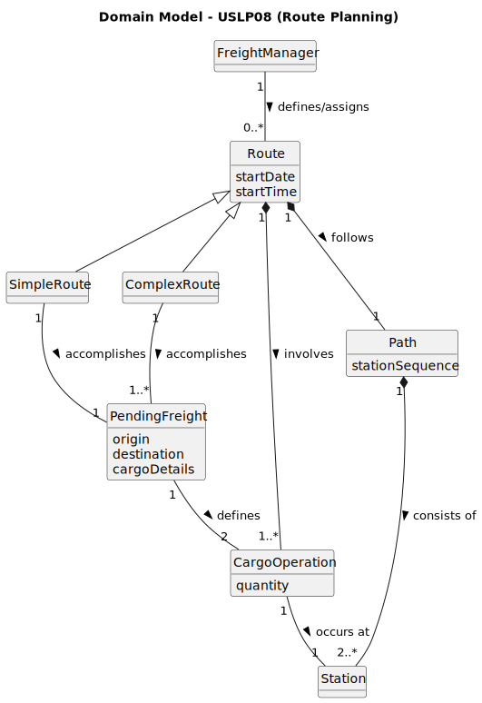

# 🚂 USPL08 - Register Electric Locomotive Model

## 2. Analysis

### 2.1. Relevant Domain Model Excerpt

The analysis focuses on the process of selecting unassigned freights and organizing them into a structured path, ensuring that all cargo operations (loading/unloading) are correctly sequenced.

***

### 2.2. Relevant Entities and Properties

The route planning process relies on these core entity properties:

* **PendingFreight**: Represents a set of wagons waiting to be dispatched.
    * **Properties**: `originStation`, `destinationStation`, `cargoVolume`, `wagonType`.
    * **State**: Must be "Unassigned" to appear in the pending list for the Manager.
* **Route**: The central entity that organizes the logistics operation.
    * **SimpleRoute**: Associated with exactly one `PendingFreight` (direct shipment from X to Y).
    * **ComplexRoute**: Associated with multiple `PendingFreight` instances, allowing for a composite journey with multiple cargo operations.
* **Path**: The physical sequence of stations through which the train travels.
    * **Properties**: An ordered `List<Station>` that realizes the route's requirements.
* **CargoOperation**: Defines what happens at each station stop.
    * **Association**: Linked to a specific `Freight` and a specific `Station`.

### 2.3. Operational Remarks and Conflict Logic

* **Freight Selection**: The Freight Manager initiates the process by requesting a list of all freights currently registered in the database but not yet assigned to a train.
* **Station Sequence**: The system must output the final ordered list of stations. For each station, the system must specify which cargo is being loaded or unloaded to satisfy the assigned freights.
* **Database Integration**: All assignments must be persisted in the remote database. This involves updating the status of the `PendingFreight` to "Scheduled" and linking it to the newly created `Route`.
