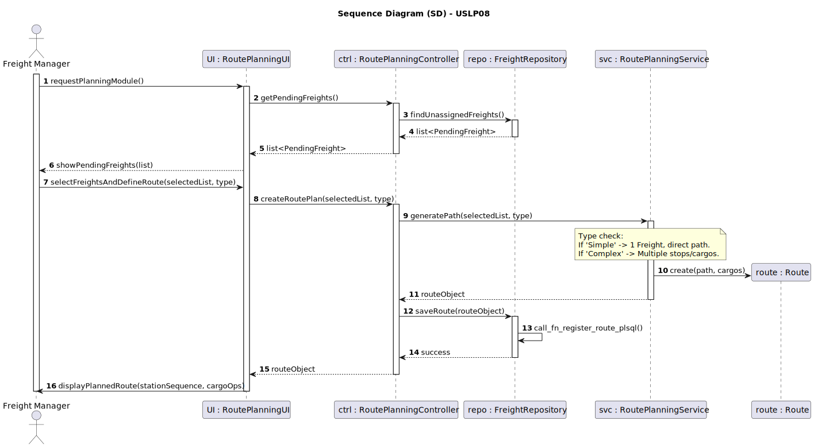
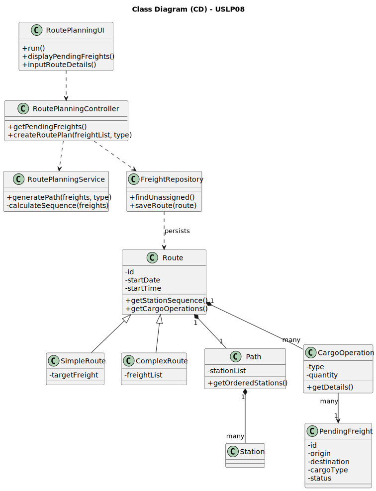

# 🚂 USPL08 - Register Electric Locomotive Model

## 3. Design

### 3.1. Rationale (GRASP Patterns)

The design allocates responsibilities for route generation, freight assignment, and data persistence, ensuring high cohesion by separating the logistics logic from the data access layer.

| Interaction ID | Question: Which class is responsible for...          | Answer                     | Justification (GRASP Pattern)                                                                                   |
|:---------------|:-----------------------------------------------------|:---------------------------|:----------------------------------------------------------------------------------------------------------------|
| Step 1         | ... interacting with the actor (Freight Manager)?    | RoutePlanningUI            | **Pure Fabrication**: Handles UI/console input and output for the planning module.                              |
| Step 2         | ... coordinating the route creation process?         | RoutePlanningController    | **Controller**:  Mediates between the UI and the core domain services.                                          |
| Step 3         | ... providing the list of unassigned freights?       | FreightRepository          | **Information Expert (IE)**: Knows how to query the database for freights with ""Pending"" status."             |
| Step 4         | ... logic for generating paths (Simple vs. Complex)? | RoutePlanningService       | **Pure Fabrication / High Cohesion**: Centralizes the logic for sequencing stations based on selected freights. |
| Step 5         | ... holding the station sequence and cargo tasks?    | Route                      | **Information Expert (IE)**: Owns the Path and the list of CargoOperation objects.                              |
| Step 6         | ... specializing the route (Simple vs. Complex)?     | SimpleRoute / ComplexRoute | **Polymorphism**: Different subclasses handle specific assignment rules (1 vs. multiple freights).              |
| Step 7         | ... persisting the new route in the remote DBMS?     | FreightRepository          | **Information Expert (IE)**: Responsible for the low-level PL/SQL function calls to ensure data integrity.      |

---

### 3.2. Systematization

Conceptual classes promoted to software classes:

* **Route** (Abstract State Container)
* **SimpleRoute, ComplexRoute** (Specialized Logic)
* **PendingFreight** (Domain Data/Status Container))
* **Station, CargoOperation** (Structural Entities)

Other software classes (i.e., Pure Fabrication) identified:

* **RoutePlanningService** (Core Algorithm/Math)
* **RoutePlanningController** (System Controller/Dependency Management)
* **RoutePlanningUI** (Presentation)
* **FreightRepository** (Persistence/Network Structure IE)

---

### 3.3. Sequence Diagram (SD)

#### Full Diagram (Conflict Resolution Flow)

This diagram illustrates the process of fetching pending freights, choosing a routing strategy, and generating the final station and cargo sequence.

### 3.4. Class Diagram (CD)

This class diagram shows the relationships crucial for performance calculation and conflict detection/storage:

**Highlights:**

* **Specialization Pattern:** SimpleRoute and ComplexRoute provide the flexibility required to handle both direct and composite shipments.
* **Task Management:** The composition between Route and CargoOperation ensures the system fulfills the acceptance criteria of presenting a detailed list of stations and associated cargo actions.