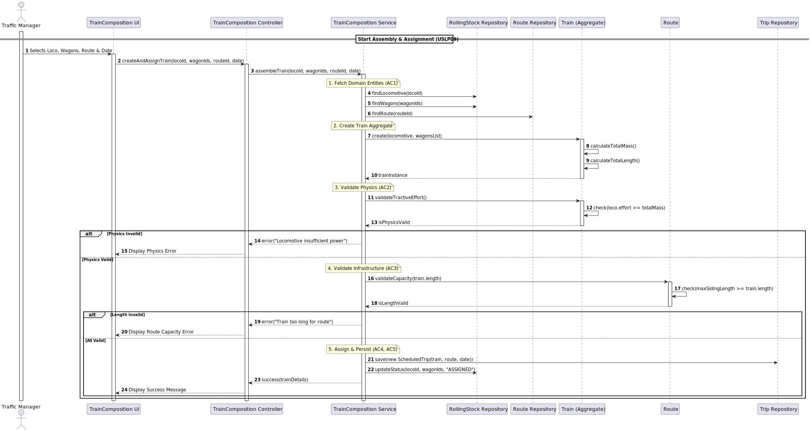

# USLP09 - Assemble and assign a train to a route

## 1. Requirements Engineering

### 1.1. User Story Description

As a **Traffic Manager**, I want to assemble a train composition (selecting a locomotive and a set of wagons) and assign it to a planned route, so that the freight can be transported according to schedule.

### 1.2. Customer Specifications and Clarifications

**From the specifications document (sem3_pi_2025_26_en_3_2.pdf):**

* **Context:** The Traffic Manager is responsible for the operational management of rolling stock. To fulfill a logistic route, a physical train must be assembled.
* **Rolling Stock:** The system must allow selecting vehicles from the available rolling stock (Locomotives and Wagons).
* **Constraints:**
    * A train is composed of exactly one **Locomotive** and one or more **Wagons**.
    * The locomotive must have enough **Tractive Effort** to pull the total mass of the wagons (tare + cargo weight) along the route's gradient (simplified as total weight capacity for this sprint).
    * The total length of the train (Locomotive + Wagons) must not exceed the maximum length allowed by the stations/sidings of the selected route.
* **Status:** The selected rolling stock must be "Available" (parked) and not currently assigned to another active trip.

### 1.3. Acceptance Criteria

* **AC1:** The system must allow the user to select one Locomotive and multiple Wagons from the repository.
* **AC2:** The system must validate that the selected Locomotive has sufficient power/tractive effort for the total weight of the composition.
* **AC3:** The system must validate that the train's total length is compatible with the selected Route's constraints (e.g., maximum siding length).
* **AC4:** The newly created Train composition must be assigned to a specific **Route** (or Scheduled Trip).
* **AC5:** Upon successful creation, the status of the selected rolling stock items must be updated (e.g., to "In Use" or "Assigned").

### 1.4. Found out Dependencies

* **USLP08 (Route Planning):** Depends on the existence of Planned Routes to which the train can be assigned.
* **BDDAD (Sprint 2):** Depends on the database/repositories containing the Rolling Stock data (Locomotives and Wagons).

### 1.5. Input and Output Data

**Input Data:**

* Selected Locomotive ID.
* List of Selected Wagon IDs.
* Selected Route ID (or Scheduled Trip ID).
* Date/Time for the assignment.

**Output Data:**

* Success/Failure operation message.
* The created **Train** object (or ID).
* Validation errors (if any, e.g., "Locomotive insufficient power").

### 1.6. System Sequence Diagram (SSD)

### 1.7. Other Relevant Remarks

* This US implements the **Factory** and **Builder** patterns implicitly by assembling complex aggregate objects (Train).
* Crucial for calculating the **Effective Speed** in USLP10, as speed depends on the total mass and locomotive power defined here.