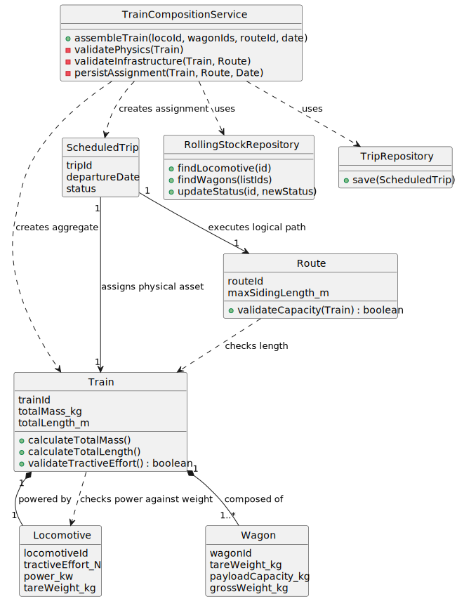

# USLP09 - Assemble and assign a train to a route

## 2. Analysis

### 2.1. Relevant Domain Model Excerpt

### 2.2. Other Remarks

* **Aggregates:** The `Train` entity acts as the **Aggregate Root** for the composition. It ensures the consistency of the "whole" (the train) regardless of the individual parts (wagons).
* **Validation Logic:** The validation rules (Weight vs Power, Length vs Infrastructure) belong to the Domain Layer (Domain Services or Entity logic), not the UI.