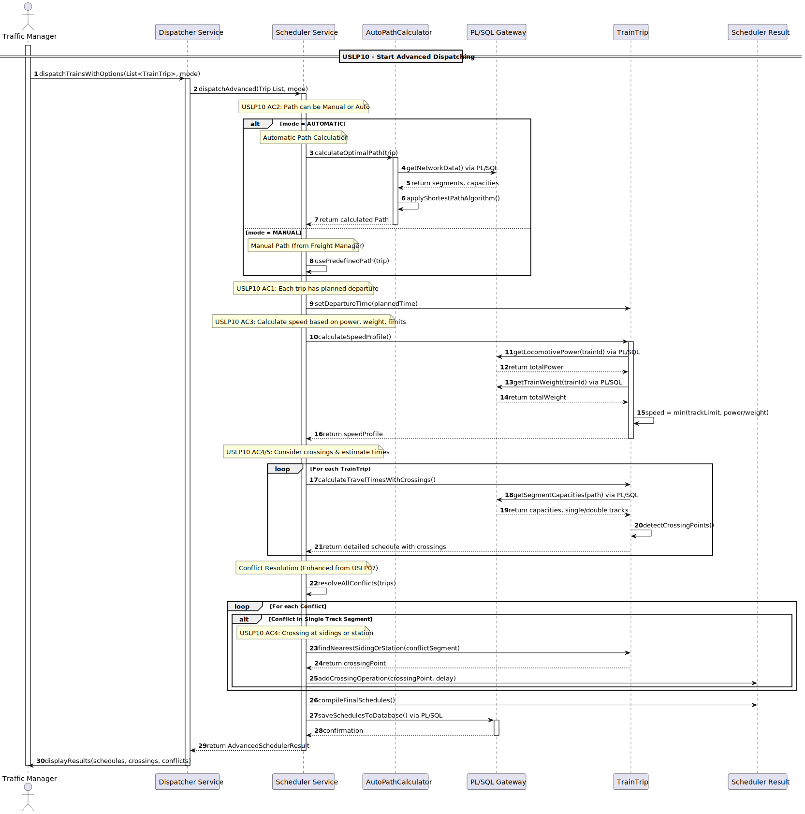

# 🚂 USLP10 - Advanced Freight Dispatching with Automatic Path Planning

## 1. Requirements Engineering

### 1.1. User Story Description

As a **Traffic Manager**, I want to use an advanced scheduler that allows me to dispatch a list of trains, where each train has an associated route (simple or complex), with **manual or automatic path calculation**, so that I can calculate optimized travel times, resolve **single-track conflicts**, and plan **crossing operations** efficiently.

---

### 1.2. Customer Specifications and Clarifications

The advanced scheduler is responsible for modeling railway operations. It must calculate the journey time **segment by segment**, considering both the track limits and the train's dynamic performance.  
Unlike USLP07, USLP10 introduces **automatic path calculation** and explicit **crossing planning**, with all infrastructure and rolling stock data obtained through **PL/SQL functions**.

| Conceito | Fonte (Enunciado / Código) | Detalhe |
|--------|----------------------------|--------|
| **Path Definition Modes** | USLP10 / `SchedulerService` | The path for each train can be defined **manually** or **automatically calculated**. |
| **Automatic Path Planning** | USLP10 / `AutoPathCalculator` | The system computes an optimal path based on network topology, segment capacities, and shortest-path logic. |
| **Vmax do Comboio** | USLP10 | Calculated dynamically using the **combined power** of locomotives and the **total weight** of wagons. |
| **Velocidade Efetiva** | USLP10 | $V_{effective} = \min(V_{segment}, V_{max\_train})$. |
| **Despacho Inicial** | USLP10 | Trains are processed in **ascending order of planned departure time**. |
| **Conflito (Via Única)** | USLP10 | A conflict occurs when two trains attempt to use the same **physical single-track segment** at overlapping times. |
| **Crossing Operations** | USLP10 | Conflicts are resolved by delaying the lower-priority train at the **nearest safe facility** (station, siding, or double track). |
| **Persistência** | USLP10 | Final schedules and crossing operations are saved using **PL/SQL functions**. |

---

### 1.3. Acceptance Criteria

* **AC1 (Departure Planning):**  
  Each train has a planned departure date/time, and trips are processed in **ascending order** of that time.

* **AC2 (Path Selection):**  
  The scheduler supports **MANUAL** and **AUTOMATIC** path definition modes.

* **AC3 (Speed Calculation):**  
  The effective speed in each segment is calculated as:  
  $V_{effective} = \min(V_{segment}, V_{max\_train})$.

* **AC4 (Conflict Detection):**  
  Conflicts are detected when two trains attempt to occupy the **same physical single-track segment** at overlapping times.

* **AC5 (Conflict Resolution / Crossing):**  
  The lower-priority train is delayed and held at the **nearest safe waiting point** (station, siding, or double-track segment), and its schedule is recalculated.

* **AC6 (Output):**  
  The system returns the final list of scheduled trips, including **estimated passage times** and a detailed list of **crossing operations**.

---

### 1.4. Domain Model and Dependencies

The USLP10 scheduling service depends on the correct interaction of the following domain elements:

* **`TrainTrip`**  
  Holds input data (`Locomotives`, `Wagons`, `PlannedDeparture`) and stores simulation results:
    * Speed profile
    * Segment entry and exit times
    * Crossing delays

* **`AutoPathCalculator`**  
  Responsible for computing optimal paths using:
    * Railway network topology
    * Segment capacities
    * Shortest-path algorithms

* **`LineSegment`**  
  Provides infrastructure constraints such as:
    * Segment length
    * Maximum allowed speed
    * Number of tracks (single or double)

* **`SchedulerService`**  
  Orchestrates:
    * Path selection (manual or automatic)
    * Speed calculation
    * Conflict detection
    * Crossing resolution
    * Final schedule compilation

* **`PL/SQL Gateway`**  
  Provides access to:
    * Network and segment data
    * Locomotive power
    * Train weight
    * Segment capacities  
      and persists final schedules and crossing operations.

---

### 1.5. Input and Output Data

| Data Flow | Fonte / Estrutura | Detalhe |
|---------|------------------|--------|
| **Input (Trips)** | `List<TrainTrip>` | Trips with planned departure times and optional manual paths. |
| **Input (Path)** | Manual / Automatic | Manual paths defined by the manager or automatic paths calculated by the system. |
| **Output (Principal)** | `SchedulerResult` | Final scheduled trips and resolved crossing operations. |
| **Output (Simulation)** | `SimulationSegmentEntry` | Segment entry/exit times, speed limits, and effective speeds. |
| **Output (Crossings)** | `CrossingOperation` | Crossing point, imposed delay, and affected train. |

---

### 1.6. System Sequence Diagram (SSD)

The following diagram illustrates the **USLP10 Advanced Freight Dispatching** flow, including automatic path calculation, PL/SQL interaction, and conflict resolution:

---

## 2. Technical Implementation Details

### 2.1. Dynamic Performance Calculation

For each `TrainTrip`, the scheduler computes the train’s maximum speed:

\[
V_{max\_train} = \min \left(
MAX\_FREIGHT\_SPEED,
\frac{P_{total} \times TRACTION\_FACTOR}{W_{total} / 1000}
\right)
\]

Where:
* $P_{total}$ is the combined locomotive power (kW)
* $W_{total}$ is the total train weight (kg)

For each segment, the effective speed is:

\[
V_{effective} = \min(V_{segment}, V_{max\_train})
\]

---

### 2.2. Advanced Dispatching Algorithm (`dispatchAdvanced`)

1. **Sorting (AC1):**  
   Trips are sorted by planned departure time.

2. **Path Determination (AC2):**
    * **MANUAL:** The predefined path is used.
    * **AUTOMATIC:** The optimal path is calculated using `AutoPathCalculator`.

3. **Initial Simulation:**  
   Each trip calculates its speed profile and initial segment entry/exit times.

4. **Conflict Detection (AC4):**  
   The scheduler detects overlapping usage of **physical single-track segments**.

5. **Crossing Resolution (AC5):**
    * The lower-priority train is delayed.
    * The nearest safe facility (station, siding, or double track) is selected.
    * A crossing operation is recorded.

6. **Cascading Recalculation:**  
   Delayed trips are fully recalculated to ensure consistency across the schedule.

7. **Final Output (AC6):**  
   Final schedules and crossing operations are compiled and persisted via PL/SQL.

---
