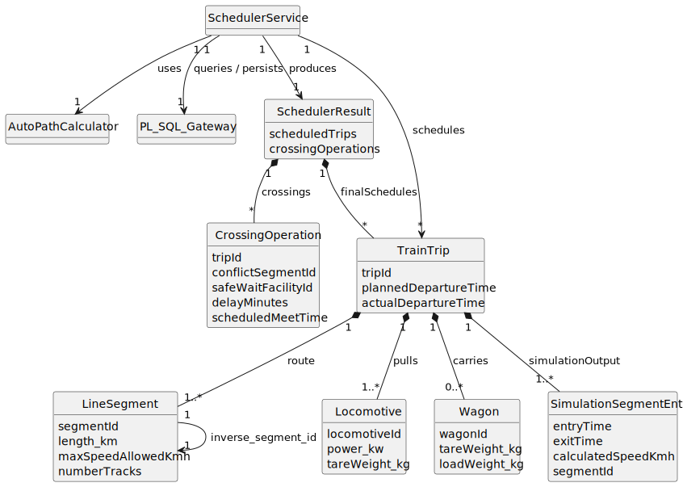

# 🚂 USLP10 - Advanced Freight Dispatching with Automatic Path Planning

## 2. Analysis

### 2.1. Relevant Domain Model Excerpt

The analysis focuses on the interaction between the **advanced scheduler** (`SchedulerService`), the **train journey** (`TrainTrip`), the **path calculation mechanism** (`AutoPathCalculator`), and the **crossing-based conflict resolution** supported by infrastructure data obtained via PL/SQL.

***

### 2.2. Relevant Entities and Properties

The advanced scheduling process relies on the following key entities and properties:

* **TrainTrip**:  
  Represents a concrete freight journey and holds both input data and dynamic simulation state.
  * **Input**: `PlannedDepartureTime`, optional manual `Route` (list of `LineSegment` IDs), `Locomotives`, `Wagons`.
  * **Derived Data**: `ActualDepartureTime`, `MaxTrainSpeed`, `SpeedProfile`.
  * **Output**: A detailed list of **`SimulationSegmentEntry`**, containing `EntryTime`, `ExitTime`, and `CalculatedSpeedKmh` for each segment, including delays caused by crossings.

* **AutoPathCalculator**:  
  Responsible for computing an **optimal route** when the automatic mode is selected.
  * Uses network topology, segment connectivity, and capacity data.
  * Returns an ordered list of `LineSegment` objects representing the calculated path.

* **Locomotive & Wagon**:  
  Used to determine the **dynamic performance** of the train.
  * **Locomotive**: Provides `PowerKW`, contributing to total traction capability.
  * **Wagon**: Determines total train weight  
    \[
    W_{total} = \sum (\text{tareWeight} + \text{loadWeight})
    \]

* **LineSegment**:  
  Represents a physical section of the railway infrastructure.
  * **Key Properties**: `length_km`, `MaxSpeedAllowedKmh`, and **`NumberTracks`** (critical for detecting single-track segments).
  * **Identification**: Must be identifiable as the **same physical segment**, regardless of direction (e.g., normalization of inverse IDs such as `INV_`).

* **CrossingOperation**:  
  Data Transfer Object (DTO) representing the outcome of conflict resolution.
  * Stores `delayMinutes`, `safeWaitFacilityId`, `conflictSegmentId`, and `scheduledMeetTime`.

* **PL/SQL Gateway**:  
  Provides access to persistent infrastructure and rolling stock data.
  * Supplies locomotive power, train weight, network topology, and segment capacities.
  * Persists final schedules and crossing operations.

---

### 2.3. Operational Remarks and Conflict Logic

* **Departure Ordering Priority**:  
  All train trips are processed in **ascending order of their planned departure time**. Earlier departures have priority during conflict resolution.

* **Path Selection Logic**:
  * In **manual mode**, the predefined route provided by the Freight Manager is used.
  * In **automatic mode**, the route is calculated dynamically using the `AutoPathCalculator`.

* **Effective Speed Calculation**:  
  For each segment, the effective speed is constrained by both infrastructure and train performance:
  \[
  V_{\text{effective}} = \min (V_{\text{segment}}, V_{\text{max\_train}})
  \]

* **Conflict Condition (Single Track)**:  
  A conflict exists when two trains attempt to occupy the **same physical single-track segment** simultaneously.  
  Detection is based on precise simulation times:
  \[
  \text{TripA.ExitTime} > \text{TripB.EntryTime}
  \]

* **Crossing-Based Conflict Resolution**:  
  When a conflict is detected:
  * The lower-priority train (`Trip B`) is delayed by the **minimum amount necessary**.
  * The train is held at the **nearest safe waiting facility** (station, siding, or double-track segment) preceding the conflict segment.
  * A **crossing operation** is recorded.
  * The delayed train’s entire schedule is **recalculated**, ensuring consistency and allowing cascading conflicts to be resolved correctly.

---

