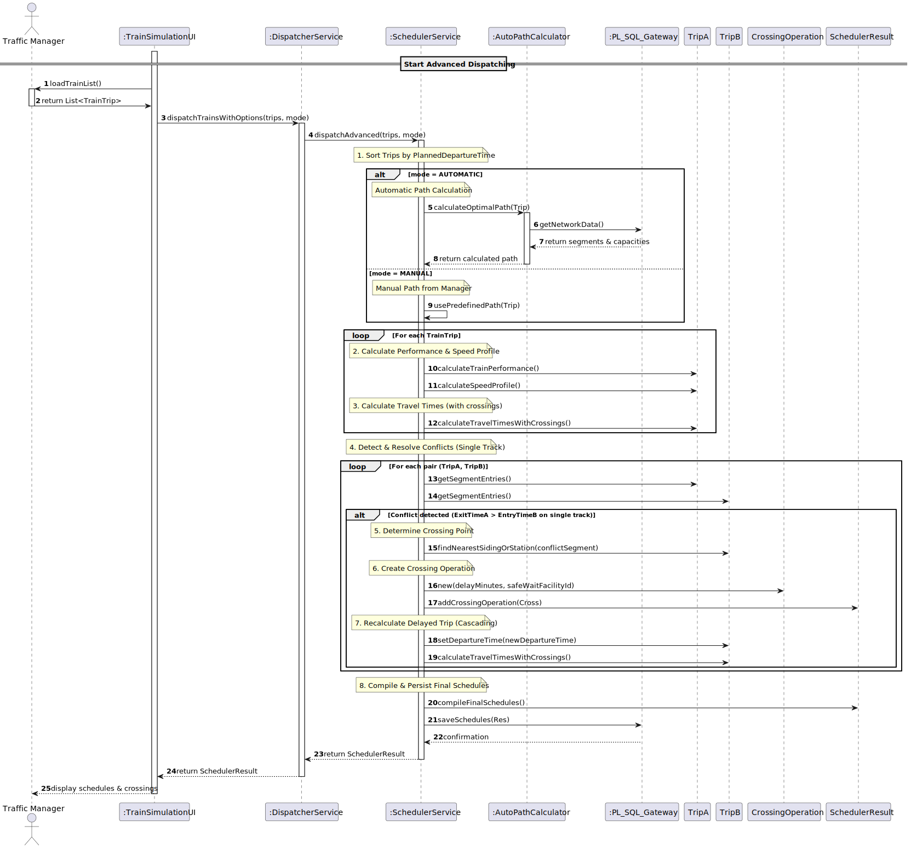
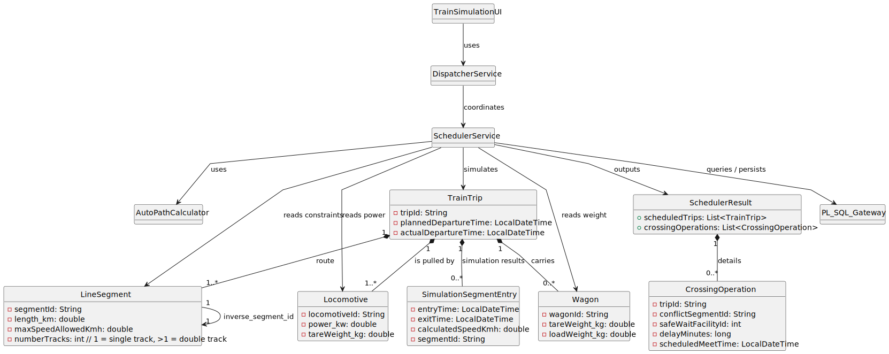

# 🚂 USLP10 - Advanced Freight Dispatching with Automatic Path Planning

## 3. Design

### 3.1. Rationale (GRASP Patterns)

The design assigns responsibilities for **path selection**, **dynamic simulation**, **speed calculation**, and **crossing-based conflict resolution**, ensuring **high cohesion** and **low coupling** while extending the architecture introduced in USLP07.

| Interaction ID | Question: Which class is responsible for... | Answer | Justification (GRASP Pattern) |
|:---|:---|:---|:---|
| Step 1 | ... interacting with the actor (Traffic Manager)? | TrainSimulationUI | **Pure Fabrication**: Handles user interaction and presentation of schedules and crossings. |
| | ... coordinating the entire advanced dispatch process? | DispatcherService | **Controller**: Mediates between UI and the scheduling subsystem. |
| | ... initiating the advanced scheduling workflow? | DispatcherService | **Creator (Rule 1)**: Initiates `SchedulerService.dispatchAdvanced(...)`. |
| Step 2 | ... selecting the path mode (manual vs automatic)? | SchedulerService | **Controller / High Cohesion**: Centralizes decision logic for dispatching behavior. |
| | ... calculating an optimal path automatically? | AutoPathCalculator | **Pure Fabrication**: Encapsulates shortest-path logic and network traversal algorithms. |
| Step 3 | ... calculating the train’s dynamic performance and speed profile? | SchedulerService | **Pure Fabrication**: Uses locomotive power and train weight to compute $V_{max\_train}$. |
| | ... accessing route and segment data? | TrainTrip | **Information Expert (IE)**: Owns the route (`LineSegment` list) and simulation state. |
| Step 4 | ... detecting single-track conflicts? | SchedulerService | **High Cohesion**: Centralizes conflict detection across all trips and segments. |
| | ... determining the crossing point and delay? | SchedulerService | **Pure Fabrication**: Applies domain rules to select the nearest safe waiting facility. |
| Step 5 | ... storing resolved crossings and final schedules? | SchedulerResult | **Pure Fabrication**: Acts as a DTO aggregating output data. |
| Step 6 | ... accessing infrastructure and persisting results? | PL/SQL Gateway | **Indirection / IE**: Isolates database access and infrastructure queries. |
| Step 7 | ... presenting the final result to the actor? | TrainSimulationUI | **Information Expert (IE)**: Displays schedules, passage times, and crossing operations. |

---

### 3.2. Systematization

Conceptual classes promoted to software classes:

* **TrainTrip** (Domain Expert / State Container)
* **LineSegment** (Domain Expert / Infrastructure Constraints)
* **Locomotive, Wagon** (Domain Experts / Performance Data)

Data Transfer Objects (DTOs):

* **SimulationSegmentEntry** (Segment-level simulation result)
* **CrossingOperation** (Resolved conflict with delay and meeting point)
* **SchedulerResult** (Aggregated output)

Pure Fabrication / Control classes:

* **SchedulerService** (Core algorithm, simulation, and conflict resolution)
* **DispatcherService** (System controller and workflow coordination)
* **AutoPathCalculator** (Automatic path planning)
* **PL/SQL Gateway** (Infrastructure data access and persistence)
* **TrainSimulationUI** (Presentation layer)

---

### 3.3. Sequence Diagram (SD)

#### Full Diagram (Advanced Dispatching Flow)

This diagram illustrates the **advanced freight dispatching process**, including path selection (manual or automatic), dynamic performance calculation, single-track conflict detection, crossing planning, cascading recalculation, and result persistence.

#### Interaction Highlights (Example Flow with Crossing)

1. **Actor Interaction:**  
   `Traffic Manager` initiates `dispatchTrainsWithOptions(trips, mode)` via `TrainSimulationUI`.

2. **Coordination:**  
   `DispatcherService` invokes `SchedulerService.dispatchAdvanced(trips, mode)`.

3. **Path Selection:**
    * Manual mode: predefined route is used.
    * Automatic mode: `AutoPathCalculator` computes the optimal path using network data.

4. **Performance & Simulation:**  
   `SchedulerService` calculates $V_{max\_train}$ and simulates segment entry/exit times for each trip.

5. **Conflict Detection:**  
   The scheduler identifies overlapping usage of **physical single-track segments**.

6. **Crossing Resolution:**  
   The lower-priority train is delayed and held at the **nearest safe facility**, generating a `CrossingOperation`.

7. **Cascading Recalculation:**  
   The delayed train’s schedule is fully recalculated to ensure global consistency.

8. **Finalization:**  
   Final schedules and crossings are compiled into `SchedulerResult` and persisted via PL/SQL.

---

### 3.4. Class Diagram (CD)

This class diagram highlights the relationships supporting **advanced dispatching**, **automatic path planning**, and **crossing-based conflict resolution**.

**Highlights:**

* **Dispatch Core:**  
  `DispatcherService` orchestrates the `SchedulerService`, which performs simulation, conflict resolution, and path coordination.

* **Path Planning:**  
  `SchedulerService` collaborates with `AutoPathCalculator` to determine optimal routes.

* **Simulation State:**  
  `TrainTrip` aggregates `SimulationSegmentEntry` objects representing detailed segment timings.

* **Crossing Resolution:**  
  Resolved conflicts are represented explicitly as `CrossingOperation` objects and returned via `SchedulerResult`.

* **Infrastructure Access:**  
  All infrastructure and rolling stock data is accessed and persisted through the `PL/SQL Gateway`.

---
